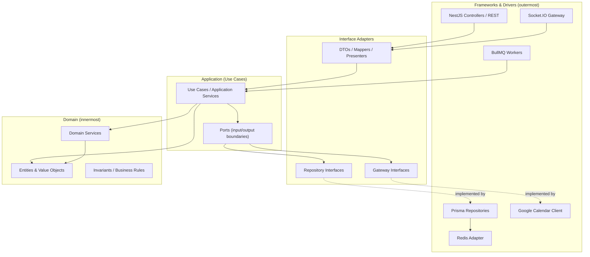
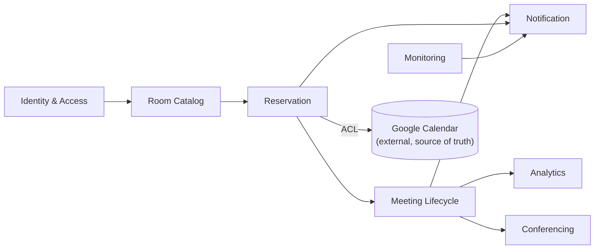
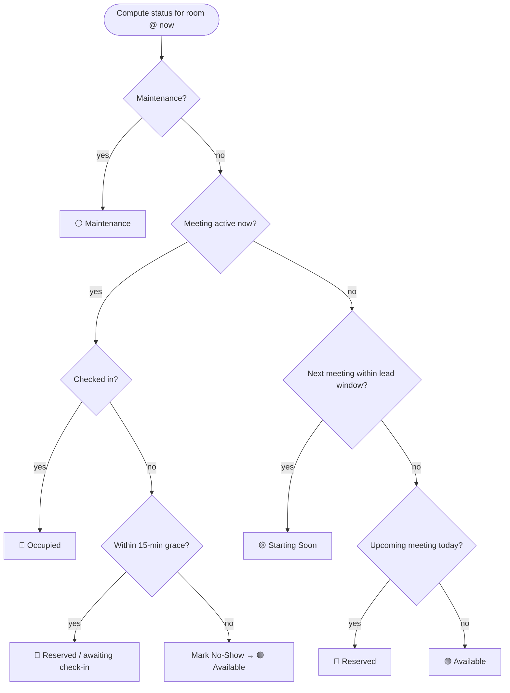
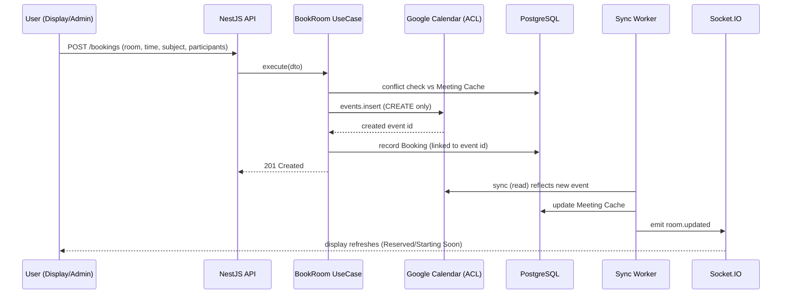

# Software Architecture

**Project:** Meeting Room Management System (MRMS)
**Document:** 04 of 19 — Software Architecture
**Status:** Draft for Approval
**Version:** 1.0
**Date:** 2026-07-20

---

## 1. Architectural Goals

The architecture must satisfy the NFRs: modular, scalable, secure, real-time,
and maintainable. It follows **Clean Architecture**, **Domain-Driven Design
(DDD)**, **SOLID**, and the **Repository Pattern**, with a clean separation
between frontend and backend and both REST and WebSocket interfaces.

Guiding principles:

1. **Google Calendar is the single source of truth** for reservations; the
   backend maintains a read-oriented cache and never edits/deletes events.
2. **Server-authoritative state** — room status is computed on the backend and
   pushed to clients.
3. **Dependency Rule** — dependencies point inward: domain has no framework
   dependencies; infrastructure depends on domain abstractions.
4. **Asynchronous by default** for external I/O (calendar sync, notifications)
   via a queue.

---

## 2. Clean Architecture Layering

Each backend module is organized into concentric layers. Dependencies always
point toward the domain.

**Layer responsibilities**

| Layer | Contains | Depends on |
|-------|----------|------------|
| Domain | Entities (Room, Meeting, Booking, CheckIn, Device...), value objects (RoomStatus, TimeRange), domain services (status computation), invariants | Nothing |
| Application | Use cases (BookRoom, CheckInMeeting, SyncCalendar, ComputeStatus), ports/interfaces | Domain |
| Interface Adapters | DTOs, mappers, controller/gateway wiring, repository & gateway interfaces | Application, Domain |
| Frameworks & Drivers | NestJS, Prisma, Socket.IO, Google client, Redis, BullMQ | Interface Adapters |

---

## 3. Domain-Driven Design

### 3.1 Bounded Contexts

| Bounded Context | Core Responsibility | Key Aggregates |
|-----------------|---------------------|----------------|
| Identity & Access | OAuth, JWT, roles, RBAC | User |
| Room Catalog | Sites, rooms, facilities, maintenance | Site, Room |
| Reservation | Reading Calendar, booking (create-only), cache | MeetingCache, Booking |
| Meeting Lifecycle | Status computation, check-in, no-show | Meeting, CheckIn |
| Conferencing | Meet/Zoom launch context | (uses Meeting) |
| Monitoring | Device heartbeat & telemetry | Device |
| Analytics | Utilization aggregates | (read models) |
| Notification | Real-time events, announcements | Announcement |

### 3.2 Ubiquitous Language (selected)

- **Room Resource** — a Google Calendar Resource mapped to a physical room.
- **Meeting Cache** — locally stored projection of Calendar events for a room.
- **Booking** — an app-initiated request that results in a *new* Calendar event.
- **Check-In** — app-managed confirmation a meeting started (PostgreSQL only).
- **No-Show** — a meeting not checked in within the grace period.
- **Status** — derived room state (Available/Occupied/Starting Soon/Maintenance/Reserved).

### 3.3 Context Map

> The **Reservation** context uses an Anti-Corruption Layer (ACL) around Google
> Calendar so the domain is never coupled to Google's API shape.

---

## 4. Runtime Components

| Component | Technology | Responsibility |
|-----------|------------|----------------|
| Web/API Gateway | Nginx | TLS termination, reverse proxy for HTTP + WS upgrade |
| Backend API | NestJS (Node.js) | REST endpoints, use-case orchestration |
| Realtime Gateway | Socket.IO (in NestJS) | Push status/notifications to displays & admin |
| Sync/Job Workers | BullMQ (Node.js) | Calendar sync, no-show sweeps, telemetry rollups |
| Datastore | PostgreSQL (via Prisma) | Persistent domain + cache + logs |
| Cache/PubSub | Redis | Caching, WebSocket scale-out adapter, queue backing |
| Frontend (Display) | React/Vite | Kiosk room display |
| Frontend (Admin) | React/Vite | Admin panel |
| External | Google OAuth + Calendar API | Identity + reservations |

---

## 5. Cross-Cutting Concerns

| Concern | Approach |
|---------|----------|
| AuthN/AuthZ | Google OAuth → JWT; NestJS Guards for RBAC on REST + WS |
| Validation | DTOs with class-validator at the boundary |
| Logging | Structured JSON logs with correlation IDs |
| Error handling | Domain errors mapped to HTTP/WS error contracts |
| Config | Central config module; runtime settings in DB (Settings) |
| Resilience | Retries + backoff on Google API; circuit-breaker on repeated failure |
| Idempotency | Booking create guarded to avoid duplicate events |
| Real-time scale-out | Socket.IO Redis adapter |

---

## 6. Status Computation (Domain Service)

Status is computed server-side from: (a) cached calendar events for the room,
(b) check-in records, (c) maintenance flag, (d) current time and configured
windows.

---

## 7. Data Flow: Booking (create-only)

---

## 8. Architectural Decisions (ADR summary)

| # | Decision | Rationale |
|---|----------|-----------|
| ADR-1 | Google Calendar as source of truth; local read cache | Brief mandate; avoids dual-write conflicts |
| ADR-2 | Create-only Calendar writes; never edit/delete | Permission constraint; safer blast radius |
| ADR-3 | Server-authoritative status | Consistency across many displays |
| ADR-4 | Queue-based sync & sweeps (BullMQ) | Decouple slow external I/O; scalable workers |
| ADR-5 | Socket.IO + Redis adapter | Real-time with horizontal scale-out |
| ADR-6 | Clean Architecture + DDD per module | Maintainability, testability, clear boundaries |
| ADR-7 | ACL around Google API | Prevent vendor coupling in domain |
| ADR-8 | Device auth separate from user auth | Kiosks are non-human actors |

---

*End of Software Architecture.*
