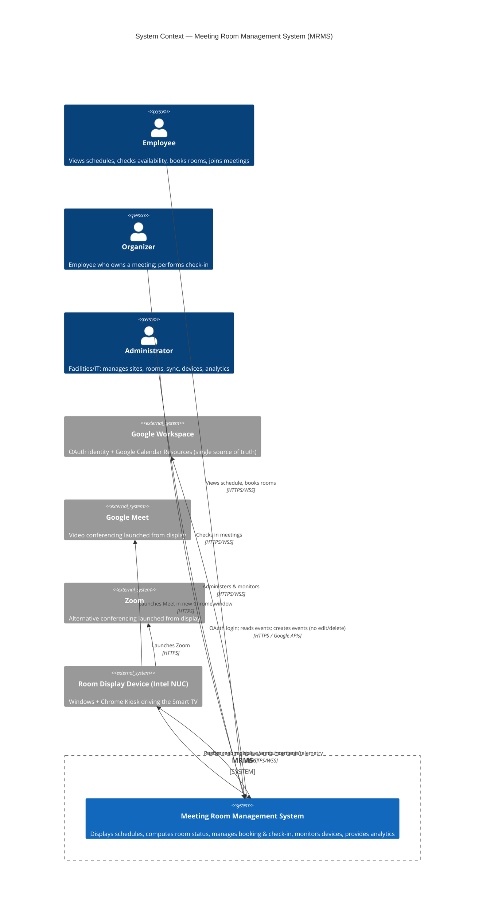

# System Context Diagram

**Project:** Meeting Room Management System (MRMS)
**Document:** 05 of 19 — System Context Diagram (C4 Level 1)
**Status:** Draft for Approval
**Version:** 1.0
**Date:** 2026-07-20

---

## 1. Purpose

This is the C4 **Level 1 (System Context)** view. It shows MRMS as a single
system and its relationships with the people (actors) and external systems it
interacts with. Internal structure is intentionally omitted (see Document 06).

---

## 2. Context Diagram



> Note: If your Mermaid renderer does not support `C4Context`, an equivalent
> flowchart is provided below.

```mermaid
flowchart TB
    EMP([Employee]):::p
    ORG([Organizer]):::p
    ADM([Administrator]):::p
    NUC([Room Display / Intel NUC]):::p

    MRMS{{"MRMS\nMeeting Room Management System"}}:::sys

    G[(Google Workspace\nOAuth + Calendar)]:::ext
    MEET[(Google Meet)]:::ext
    ZOOM[(Zoom)]:::ext

    EMP -->|book, view: HTTPS/WSS| MRMS
    ORG -->|check-in: HTTPS/WSS| MRMS
    ADM -->|administer: HTTPS/WSS| MRMS
    NUC -->|heartbeat/telemetry: HTTPS/WSS| MRMS
    MRMS -->|realtime push: WSS| NUC
    MRMS -->|OAuth, read events, create events\n(NO edit/delete)| G
    NUC -->|launch| MEET
    NUC -->|launch| ZOOM

    classDef p fill:#e8f0fe,stroke:#4285f4,color:#1a1a1a;
    classDef sys fill:#d2e3fc,stroke:#1a73e8,color:#1a1a1a,font-weight:bold;
    classDef ext fill:#f1f3f4,stroke:#9aa0a6,color:#1a1a1a;
```

---

## 3. Actors

| Actor | Type | Interaction |
|-------|------|-------------|
| Employee | Person | Views schedule/availability, books available rooms, joins meetings |
| Organizer | Person | Employee owning a meeting; performs check-in |
| Administrator | Person | Manages sites/rooms/facilities, triggers sync, monitors devices, views analytics, broadcasts announcements |
| Room Display (Intel NUC) | System actor | Renders room-specific display, sends heartbeat/telemetry, launches Meet/Zoom |

---

## 4. External Systems

| System | Role | Direction | Notes |
|--------|------|-----------|-------|
| Google Workspace (OAuth) | Identity provider | MRMS → Google | Only allowed auth method |
| Google Calendar (Resources) | Reservation source of truth | MRMS ⇄ Google | Read + Create only; no edit/delete |
| Google Meet | Conferencing | NUC → Meet | Launched from display; auto-close on end |
| Zoom | Conferencing | NUC → Zoom | Launched if Zoom URL present |

---

## 5. Trust & Data Boundaries

- All person/device ↔ MRMS traffic crosses the **HTTPS/WSS** boundary via Nginx.
- MRMS ↔ Google crosses an **external internet** boundary using OAuth-scoped
  credentials (least privilege: read calendar + create events).
- Conferencing launches happen **from the NUC directly** to Meet/Zoom, using the
  NUC's pre-authenticated Google account and pre-granted camera/mic permissions.
- On-premise: MRMS backend and PostgreSQL/Redis reside inside the corporate
  network; only Google API egress leaves the premises.

---

## 6. Key Context-Level Constraints

1. Google Calendar remains authoritative; MRMS augments (never overrides) it.
2. MRMS must operate acceptably degraded if Google APIs are temporarily
   unreachable (serve cached schedule).
3. Every room maps 1:1 to a Google Resource and to one NUC display.

---

*End of System Context Diagram.*
