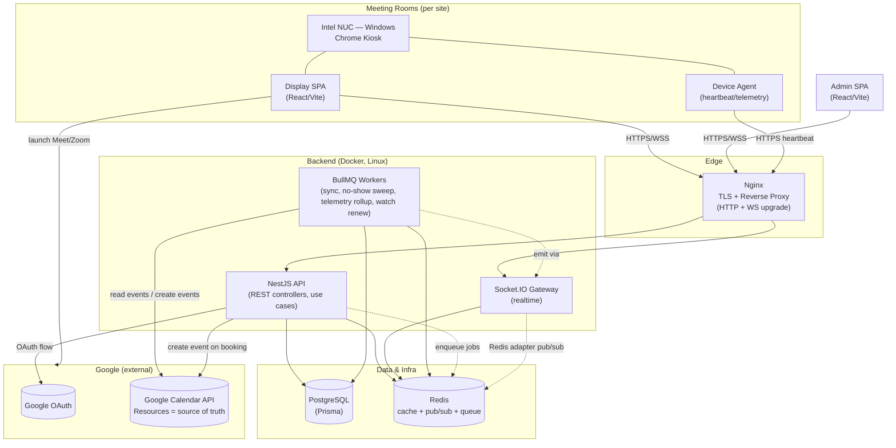
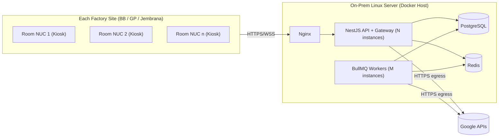

# High-Level Architecture Diagram

**Project:** Meeting Room Management System (MRMS)
**Document:** 06 of 19 — High-Level Architecture (C4 Level 2 — Containers)
**Status:** Draft for Approval
**Version:** 1.0
**Date:** 2026-07-20

---

## 1. Purpose

This is the C4 **Level 2 (Container)** view: the deployable/runnable units inside
MRMS, their responsibilities, and how they communicate. "Container" here means a
runtime process/service, not strictly a Docker container (though most map 1:1).

---

## 2. Container Diagram

---

## 3. Containers & Responsibilities

| Container | Tech | Responsibility | Scaling |
|-----------|------|----------------|---------|
| Display SPA | React, TypeScript, Vite, Tailwind | Room-specific fullscreen display; consumes REST + WS; launches Meet/Zoom | Static asset, per NUC |
| Admin SPA | React, TypeScript, Vite, Tailwind | Admin panel: config, monitoring, analytics, announcements | Static asset |
| Device Agent | Lightweight Windows agent/script | Sends heartbeat + telemetry (CPU/RAM/storage/peripherals/Chrome/display) | Per NUC |
| Nginx | Nginx | TLS termination, reverse proxy, WS upgrade, static hosting | Edge, HA-capable |
| NestJS API | NestJS/Node | REST endpoints, orchestrates use cases, booking create | Horizontal (stateless) |
| Socket.IO Gateway | NestJS + Socket.IO | Real-time push (status, notifications, announcements) | Horizontal via Redis adapter |
| BullMQ Workers | Node + BullMQ | Calendar sync, no-show sweeps, telemetry rollups, watch-channel renewal | Horizontal by queue |
| PostgreSQL | PostgreSQL + Prisma | Domain data, meeting cache, check-in, logs, analytics | Primary + backups |
| Redis | Redis | Cache, queue backing, Socket.IO pub/sub | Managed/HA |

> Note: API and Gateway may run in the same NestJS process or be split; the
> diagram treats them as logical containers. Workers run as separate processes.

---

## 4. Communication Matrix

| From | To | Protocol | Purpose |
|------|----|----------|---------|
| Display/Admin SPA | Nginx → API | HTTPS (REST) | Data & commands |
| Display/Admin SPA | Nginx → Gateway | WSS | Realtime updates |
| Device Agent | Nginx → API | HTTPS | Heartbeat/telemetry |
| API | PostgreSQL | TCP (Prisma) | Persistence |
| API/Gateway/Worker | Redis | TCP | Cache/pubsub/queue |
| API | Redis (enqueue) | TCP | Trigger sync/jobs |
| Worker | Google Calendar | HTTPS | Read/Create events |
| API | Google OAuth/Calendar | HTTPS | Login, booking create |
| Worker | Gateway | Redis pub/sub | Emit realtime events |
| Display (NUC) | Meet/Zoom | HTTPS | Launch conferencing |

---

## 5. Deployment View (On-Premise)

**Notes**
- All backend services are containerized (Docker) and orchestrated on the Linux
  host (Docker Compose for v1; can migrate to orchestration later).
- Nginx is the only inbound entry point; only Google API egress leaves premises.
- Displays across all sites connect back to the central backend (assumes routable
  network between sites and the server; confirm topology during deployment).

---

## 6. Scaling & Resilience Summary

| Concern | Mechanism |
|---------|-----------|
| API throughput | Stateless NestJS instances behind Nginx |
| Realtime fan-out | Socket.IO Redis adapter across gateway instances |
| Sync load | Dedicated BullMQ workers, scaled by queue depth |
| External API failure | Retry/backoff, cached serving, sync-status surfacing |
| Data durability | PostgreSQL with scheduled backups |
| Display offline | Detected via heartbeat; last-known schedule served |

---

## 7. Mapping to Modules (preview of Backend Architecture, Doc 16)

| Container | Hosts Modules |
|-----------|---------------|
| NestJS API | Auth, Room, Site/Admin, Booking, Meeting, CheckIn, Analytics, Monitoring, Notification, Google Integration |
| Gateway | Notification (realtime), Meeting (status push) |
| Workers | Calendar Sync, CheckIn (no-show sweep), Monitoring (rollups), Google Integration (watch renew) |

---

*End of High-Level Architecture Diagram.*
