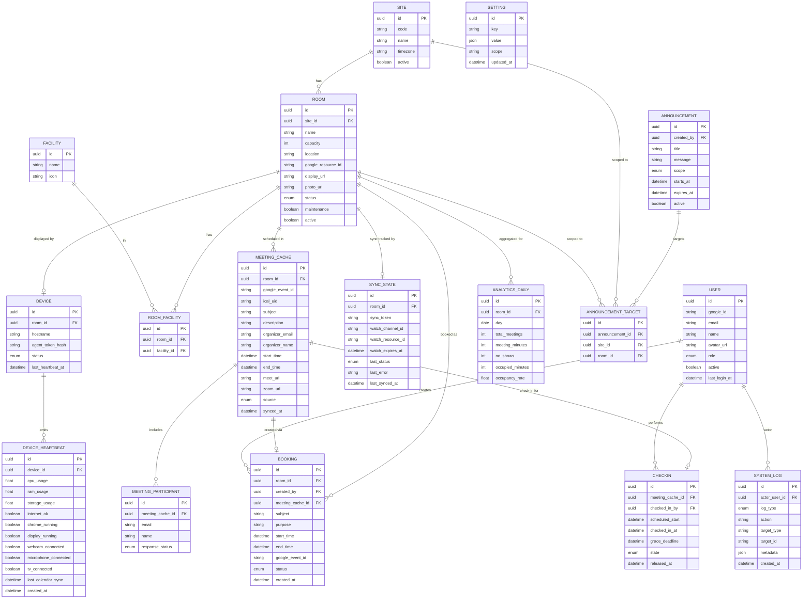

# Database ERD

**Project:** Meeting Room Management System (MRMS)
**Document:** 07 of 19 — Entity Relationship Diagram
**Status:** Draft for Approval
**Version:** 1.0
**Date:** 2026-07-20

---

## 1. Purpose

Logical data model for MRMS in PostgreSQL. It reflects that **Google Calendar is
the source of truth** — reservation detail is mirrored into `MeetingCache`, while
app-owned state (check-in, no-show, analytics, monitoring, logs, settings) lives
authoritatively in PostgreSQL.

---

## 2. Entity Overview

| Entity | Ownership | Notes |
|--------|-----------|-------|
| User | App | From Google Workspace identity; role assigned |
| Site | App | Factory site (BB, GP, Jembrana...) |
| Room | App | Maps 1:1 to Google Resource and one display |
| Facility | App | Master list of facilities |
| RoomFacility | App | Join Room↔Facility (many-to-many) |
| MeetingCache | Mirror | Projection of Google Calendar events per room |
| MeetingParticipant | Mirror | Attendees of a cached meeting |
| Booking | App | App-initiated create → links to created event |
| CheckIn | App | Check-in / no-show state per meeting occurrence |
| Device | App | One NUC per room |
| DeviceHeartbeat | App | Time-series telemetry |
| Announcement | App | Broadcast messages |
| AnnouncementTarget | App | Scope of an announcement |
| AnalyticsDaily | App | Pre-aggregated daily metrics per room |
| SystemLog | App | System/activity/audit log |
| Setting | App | Runtime configuration key/value |
| SyncState | App | Per-room calendar sync tokens/status |

---

## 3. ERD

---

## 4. Relationship Notes

- **Site 1—N Room**; **Room 1—0..1 Device** (one NUC per room, optional until installed).
- **Room N—M Facility** through `RoomFacility`.
- **Room 1—N MeetingCache**; a cached meeting has **N participants**.
- **Booking** optionally links to the `MeetingCache` row once the created event
  syncs back (matched by `google_event_id`).
- **CheckIn** is keyed to a specific meeting occurrence (`meeting_cache_id`) and
  never writes to Google Calendar.
- **SyncState** is per-room and stores the incremental `sync_token` and Google
  watch-channel metadata.
- **AnalyticsDaily** is a derived rollup (populated by a worker) for fast dashboards.
- **SystemLog** covers system, activity, and audit logs distinguished by `log_type`.

---

## 5. Enumerations

| Enum | Values |
|------|--------|
| RoomStatus | AVAILABLE, OCCUPIED, STARTING_SOON, MAINTENANCE, RESERVED |
| UserRole | ADMINISTRATOR, EMPLOYEE |
| MeetingSource | GOOGLE_CALENDAR, APP_BOOKING |
| ResponseStatus | ACCEPTED, DECLINED, TENTATIVE, NEEDS_ACTION |
| BookingStatus | CREATED, SYNCED, FAILED, CANCELLED_EXTERNALLY |
| CheckInState | PENDING, CHECKED_IN, NO_SHOW, RELEASED |
| DeviceStatus | ONLINE, OFFLINE, DEGRADED, UNKNOWN |
| AnnouncementScope | GLOBAL, SITE, ROOM |
| LogType | SYSTEM, ACTIVITY, AUDIT |
| SyncStatus | SUCCESS, PARTIAL, FAILED |

---

## 6. Indexing & Integrity (highlights)

- Unique: `Room.google_resource_id`, `User.google_id`, `User.email`,
  `MeetingCache(room_id, google_event_id)`, `Setting.key(+scope)`.
- Hot query indexes: `MeetingCache(room_id, start_time, end_time)`,
  `DeviceHeartbeat(device_id, created_at)`, `SystemLog(created_at, log_type)`,
  `AnalyticsDaily(room_id, day)`.
- FK cascade: deleting a `Room` is discouraged; prefer `active=false`. Cache and
  heartbeat rows are prunable by retention policy.

---

*End of Database ERD.*
