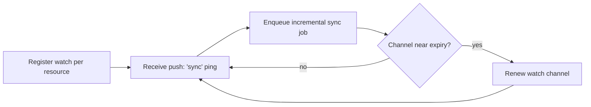
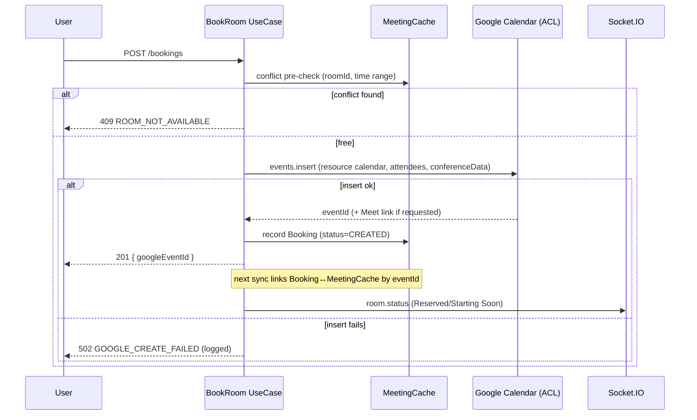

# Google Calendar Integration Design

**Project:** Meeting Room Management System (MRMS)
**Document:** 10 of 19 — Google Calendar Integration Design
**Status:** Draft for Approval
**Version:** 1.0
**Date:** 2026-07-20

---

## 1. Principles

1. **Google Calendar is the single source of truth** for reservations.
2. The application has **read** and **create** permissions only — **never edit,
   never delete** existing events.
3. All Google access is wrapped by an **Anti-Corruption Layer (ACL)** so the
   domain never depends on Google API shapes.
4. Each room is a **Google Calendar Resource**; its `googleResourceId` maps to a
   calendar whose events represent that room's reservations.

---

## 2. Authorization Model

| Aspect | Choice | Rationale |
|--------|--------|-----------|
| Credential type | **Service account with domain-wide delegation**, OR a dedicated Workspace service user with OAuth | Server-side sync without per-user consent for reading resource calendars |
| Scopes | `https://www.googleapis.com/auth/calendar.events` (create), `.../auth/calendar.readonly` (read) | Least privilege; no delete/edit scope requested |
| Booking author | Event created **on the room resource calendar**, organizer = booking user where possible | Reflects who booked |
| User login | Separate OAuth (see Doc 12) for identity | Distinct concern from resource sync |

> Final credential choice (service account vs. delegated user) is a deployment
> decision; the ACL abstracts it. Requesting only create+read scopes technically
> enforces the no-edit/no-delete rule at the API permission level.

---

## 3. Read / Sync Strategy

### 3.1 Two-tier freshness

| Tier | Mechanism | Purpose |
|------|-----------|---------|
| Push (preferred) | Google Calendar **watch channels** (push notifications) per resource | Near-real-time change signal |
| Poll (baseline/fallback) | Scheduled **incremental sync** using `syncToken` per room | Guaranteed convergence, handles missed pushes |

### 3.2 Incremental sync with tokens

```mermaid
sequenceDiagram
    participant W as Sync Worker (BullMQ)
    participant S as SyncState (DB)
    participant G as Google Calendar API (ACL)
    participant C as MeetingCache (DB)
    participant WS as Socket.IO

    W->>S: read syncToken for room
    alt token present
        W->>G: events.list(syncToken)
    else no/invalid token
        W->>G: events.list(timeMin=todayStart, singleEvents=true)
    end
    G-->>W: changed events (+ nextSyncToken)
    W->>C: upsert changed events; mark removed (status=cancelled)
    W->>S: store nextSyncToken, lastSyncedAt, status
    W->>WS: emit calendar.updated / room.status
    Note over W,G: 410 GONE → clear token → full resync
```

### 3.3 Watch channel lifecycle



- Watch channels expire; a scheduled worker renews before `watchExpiresAt`.
- Push endpoint (`/google/notifications`) validates channel token, then enqueues
  a sync job (it does not trust the push payload as data — it only triggers a read).

---

## 4. Event Field Mapping (Google → MeetingCache)

| Google field | MeetingCache field | Notes |
|--------------|--------------------|-------|
| `id` | `googleEventId` | Unique per calendar |
| `iCalUID` | `icalUid` | Cross-instance identity |
| `summary` | `subject` | |
| `description` | `description` | |
| `organizer.email/displayName` | `organizerEmail/Name` | |
| `start.dateTime` / `end.dateTime` | `startTime/endTime` | Converted to UTC |
| `hangoutLink` or `conferenceData` | `meetUrl` | Google Meet link |
| description/location parse | `zoomUrl` | Extract Zoom URL if present |
| `attendees[]` | `MeetingParticipant[]` | email, name, responseStatus |
| `status == cancelled` | soft-remove from cache | Never call delete on Google |

**Zoom detection:** scan `conferenceData`, `location`, and `description` for a
Zoom URL pattern; store in `zoomUrl` if found.

---

## 5. Booking (Create-Only) Flow



- Optionally request `conferenceData` to auto-generate a Google Meet link.
- Attendees are invited via the created event; MRMS does not later modify them.

---

## 6. Handling the No-Edit / No-Delete Constraint

| Desired action | MRMS behavior |
|----------------|---------------|
| Cancel a booking | Not performed by app; UI directs user to Google Calendar. If cancelled there, sync detects `status=cancelled` and updates cache + emits `meeting.cancelled`. |
| Reschedule | Not performed by app; user edits in Google Calendar; sync reflects it. |
| Mark no-show | App-only state in `CheckIn`/analytics; Calendar unchanged. |
| Extend meeting | Not performed by app. |

Because edit/delete scopes are never requested, accidental mutation is impossible
at the API-permission level (defense in depth beyond code discipline).

---

## 7. Resilience & Rate Limits

| Concern | Strategy |
|---------|----------|
| API quota / 403 rateLimitExceeded | Exponential backoff + jitter; per-room job spacing |
| 410 invalid sync token | Clear token, perform bounded full resync (today→N days) |
| Google outage | Serve cached schedule; `SyncState.lastStatus=FAILED`; surface in admin sync status; display shows staleness |
| Partial failures | Per-room isolation so one room's failure doesn't block others |
| Clock/timezone | Store UTC; render per `Site.timezone` |

---

## 8. Security

- Google credentials/tokens stored encrypted (NFR-SEC-5), never in source.
- Push notification endpoint validates the channel token before acting.
- Sync jobs run in workers with no inbound exposure except the validated push route.
- Booking create is authorized (JWT + RBAC) and rate-limited.

---

## 9. Configuration

| Setting | Default | Purpose |
|---------|---------|---------|
| `syncIntervalSeconds` | 60 | Poll cadence (fallback + baseline) |
| `syncWindowDays` | 14 | How far ahead to cache |
| `watchRenewLeadMinutes` | 60 | Renew channels before expiry |
| `useWatchChannels` | true | Toggle push vs. poll-only |

---

*End of Google Calendar Integration Design.*
