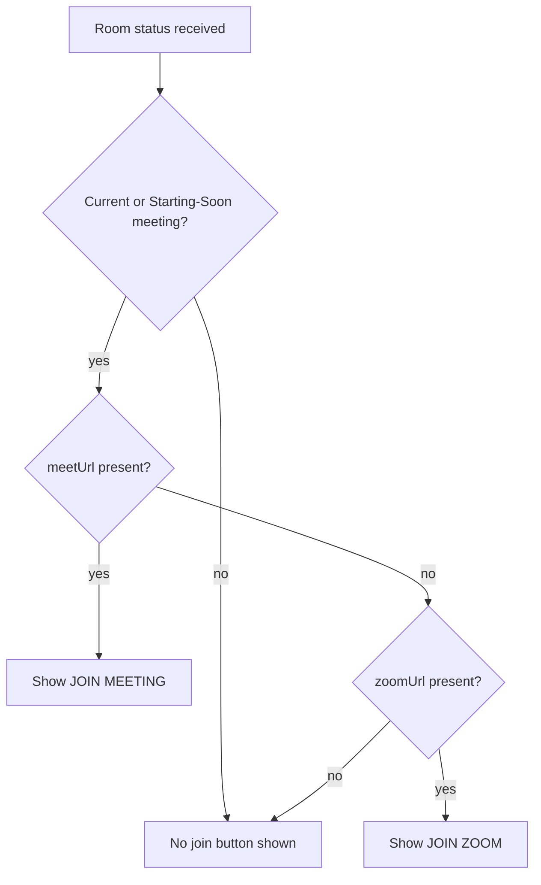
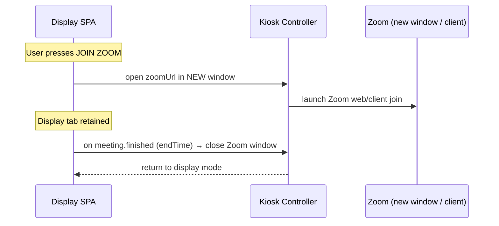

# Google Meet & Zoom Integration Flow

**Project:** Meeting Room Management System (MRMS)
**Document:** 11 of 19 — Conferencing (Meet / Zoom) Integration Flow
**Status:** Draft for Approval
**Version:** 1.0
**Date:** 2026-07-20

---

## 1. Purpose

Define how the room display launches Google Meet (and Zoom) from the Intel NUC
kiosk, and how it returns to display mode automatically when the meeting ends.

---

## 2. Preconditions (per NUC)

- Chrome runs in **Kiosk mode**; the Google account is **already signed in**.
- **Webcam** and **microphone** permissions are **pre-granted** in Chrome for
  `meet.google.com` (and Zoom domains), so no permission prompt appears.
- The display SPA knows the current meeting's `meetUrl` / `zoomUrl` from the
  room status payload (synced from Google Calendar).

---

## 3. Join Button Availability



- **Join Meeting** appears when the current/imminent meeting has a Meet link.
- **Join Zoom** appears when a Zoom URL is present and no Meet link is used.
- Buttons are large and TV-optimized (NFR-USE-1).

---

## 4. Google Meet Launch Flow

```mermaid
sequenceDiagram
    participant D as Display SPA (Kiosk tab)
    participant K as Kiosk Controller (Chrome)
    participant M as Google Meet (new window)
    participant WS as Backend (Socket.IO)

    D->>WS: (already subscribed room:{id})
    Note over D: User presses JOIN MEETING
    D->>K: open meetUrl in NEW Chrome window (fullscreen)
    K->>M: navigate to meet.google.com/...
    M-->>K: joined (account + cam/mic ready, no prompt)
    Note over D,WS: Display tab remains; backend tracks meeting window
    WS-->>D: meeting.finished (end time reached) OR manual end detected
    D->>K: close Meet window
    K-->>D: focus returns to Display tab (display mode)
```

### 4.1 Return-to-display triggers

The Meet window is closed and the kiosk returns to display mode when **any** of:

| Trigger | Source |
|---------|--------|
| Meeting `endTime` reached | Backend timer → `meeting.finished` WS event |
| Meeting detected cancelled/removed | Calendar sync → `meeting.cancelled` |
| Idle/heuristic end (optional) | Kiosk controller detects Meet "call ended" URL/state |
| Manual close (if display is touch) | User action |

> Because MRMS cannot rely on Google Meet emitting an app-facing "call ended"
> signal, the **authoritative return trigger is the scheduled `endTime`** pushed
> by the backend, with optional kiosk-side heuristics as a secondary trigger.

---

## 5. Zoom Launch Flow



- If Zoom opens the native client, the kiosk controller manages the extra window;
  return-to-display is still driven by the backend `endTime` signal.

---

## 6. Kiosk Controller Responsibilities

The "Kiosk Controller" is the mechanism that opens/closes conferencing windows.
Design options (final choice is a deployment/implementation decision):

| Option | How | Trade-off |
|--------|-----|-----------|
| `window.open` + `window.close` from SPA | Pure web | Simple; limited control over external client windows |
| Chrome kiosk flags + managed extension | Extension controls tabs/windows | More control; needs deployment/packaging |
| Local companion agent (with Device Agent) | OS-level window control | Most robust for native Zoom; more moving parts |

Recommended v1: SPA `window.open` for Meet (web) with backend-driven close signal;
companion agent considered if native Zoom control is required.

---

## 7. State & Events

| WS event | Effect on display |
|----------|-------------------|
| `meeting.started` | Optionally surface "in progress"; join button remains |
| `meeting.finished` | Trigger close of Meet/Zoom window, return to display |
| `meeting.cancelled` | Close conferencing window if open; refresh schedule |
| `room.status` | Recompute join-button visibility |

---

## 8. Failure & Edge Handling

| Scenario | Handling |
|----------|----------|
| No network to Meet | Show error toast on display; remain in display mode |
| Popup blocked | Kiosk policy must allow popups for meet/zoom domains (deployment) |
| Meeting runs past endTime | Optional grace before auto-close; configurable `joinAutoCloseGraceMinutes` |
| Multiple meetings back-to-back | Close previous window before next join; status drives buttons |
| Meet link missing but Zoom present | Show Join Zoom instead |

---

## 9. Configuration

| Setting | Default | Purpose |
|---------|---------|---------|
| `joinAutoCloseGraceMinutes` | 5 | Grace after endTime before forcing return |
| `enableZoom` | true | Feature toggle for Zoom join |
| `meetOpenMode` | `new-window` | How Meet is launched |

---

*End of Google Meet & Zoom Integration Flow.*
