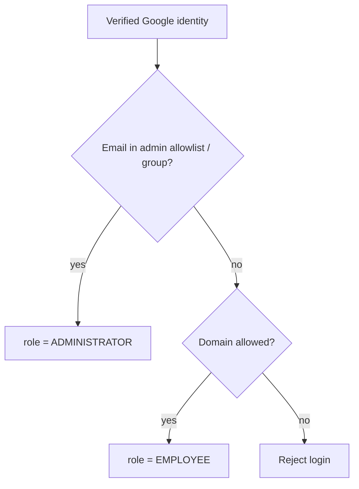
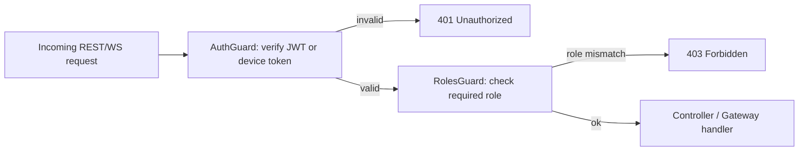
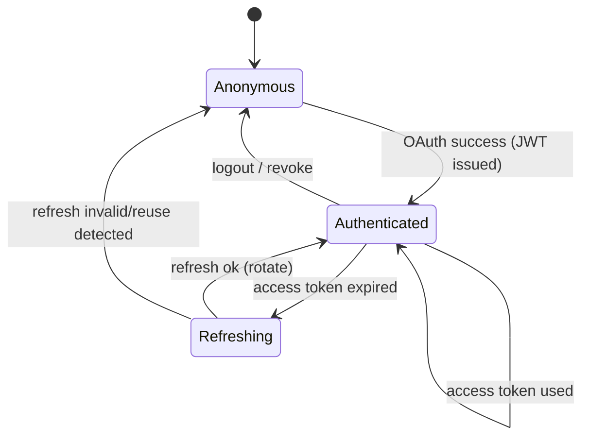

# Authentication Flow

**Project:** Meeting Room Management System (MRMS)
**Document:** 12 of 19 — Authentication & Authorization Flow
**Status:** Draft for Approval
**Version:** 1.0
**Date:** 2026-07-20

---

## 1. Principles

- **Identity provider:** Google Workspace OAuth 2.0 **only** (FR-AUTH-1).
- **Session:** app-issued **JWT** access tokens + refresh tokens.
- **Authorization:** **RBAC** with roles `ADMINISTRATOR` and `EMPLOYEE`
  (FR-AUTH-3/4).
- **Displays are devices, not people:** kiosks authenticate with a room-scoped
  **device token** (FR-AUTH-8), never a user login.
- **Domain restriction:** login limited to the organization's Workspace
  domain(s) (FR-AUTH-6).

---

## 2. User Login (OAuth 2.0 Authorization Code)

```mermaid
sequenceDiagram
    participant B as Browser (Admin/Employee SPA)
    participant API as NestJS API
    participant G as Google OAuth
    participant DB as PostgreSQL

    B->>API: GET /auth/google
    API-->>B: 302 redirect to Google consent (scope: openid email profile)
    B->>G: authenticate + consent
    G-->>B: 302 back to /auth/google/callback?code=...
    B->>API: GET /auth/google/callback?code=...
    API->>G: exchange code for Google tokens + id_token
    G-->>API: id_token (email, sub, hd/domain), profile
    API->>API: verify id_token, check allowed domain
    API->>DB: upsert User (googleId, email, name, avatar); resolve role
    API-->>B: set access JWT (short-lived) + refresh token (httpOnly cookie)
    B->>API: subsequent calls with Authorization: Bearer <JWT>
```

### 2.1 Token design

| Token | Lifetime (proposed) | Storage | Contents |
|-------|--------------------|---------|----------|
| Access JWT | 15 min | memory / Authorization header | `sub`, `email`, `role`, `iat`, `exp` |
| Refresh token | 7 days (rotating) | httpOnly, Secure cookie | opaque/rotated; server-tracked |

- JWT signed with a rot-capable key (RS256 preferred for verification separation).
- `POST /auth/refresh` issues a new access token and rotates the refresh token.
- `POST /auth/logout` revokes the refresh token/session.

### 2.2 Role resolution



- Admin membership sourced from an allowlist/Workspace group (configurable in
  Settings / bootstrap). All other allowed-domain users are `EMPLOYEE`.

---

## 3. Device (Kiosk) Authentication

```mermaid
sequenceDiagram
    participant ADM as Administrator
    participant API as NestJS API
    participant DB as PostgreSQL
    participant NUC as Room Display (Kiosk)

    ADM->>API: Provision device for room (Admin Panel)
    API->>DB: create Device; generate device token (store hash)
    API-->>ADM: one-time device token (shown once)
    Note over ADM,NUC: token embedded in kiosk display URL/config
    NUC->>API: connect WS / POST heartbeat with X-Device-Token
    API->>DB: verify token hash → device + room scope
    API-->>NUC: authorized (room-scoped); subscribe room:{id}, site:{id}
```

- Device tokens are **room-scoped**, **revocable**, and **hashed at rest**
  (NFR-SEC-9). A compromised token affects only one room and can be rotated.
- Displays get read/subscribe rights for their room plus the ability to POST
  heartbeats and perform on-display actions (book/check-in) which still require
  the acting user context where applicable.

> Open question (from PRD): if on-display Book/Check-In is user-attributed,
> the display may prompt a lightweight user identification for those specific
> actions while the device token authorizes the display itself. To confirm.

---

## 4. Authorization (RBAC Enforcement)



- NestJS **Guards** enforce authentication then role checks.
- Admin-only routes (🔒ADM in Doc 09) require `ADMINISTRATOR`.
- WebSocket handshake authenticated the same way; channel joins are authorized by
  role/room scope.

| Capability | EMPLOYEE | ADMINISTRATOR | DEVICE |
|------------|:--------:|:-------------:|:------:|
| View schedule/status | ✔ | ✔ | ✔ (own room) |
| Book available room | ✔ | ✔ | via user |
| Check-in | ✔ (organizer) | ✔ | via user |
| Manage sites/rooms/facilities | ✘ | ✔ | ✘ |
| Trigger sync / view sync status | ✘ | ✔ | ✘ |
| Device monitoring / logs / analytics | ✘ | ✔ | ✘ |
| Broadcast announcements | ✘ | ✔ | ✘ |
| Submit heartbeat | ✘ | ✘ | ✔ |

---

## 5. Security Controls

| Control | Detail |
|---------|--------|
| Transport | HTTPS/WSS only (NFR-SEC-1) |
| Token integrity | Signed JWT; verify signature, `exp`, issuer, audience |
| Domain restriction | Reject `id_token` outside allowed `hd`/domain |
| Refresh rotation | One-time-use refresh tokens; reuse detection revokes session |
| Rate limiting | On `/auth/*` and `/bookings` (NFR-SEC-10) |
| Audit | `auth.login`, `auth.logout`, `auth.refresh`, admin actions logged (FR-AUTH-7) |
| Secret storage | OAuth client secret, JWT keys, device tokens hashed/encrypted (NFR-SEC-4/5/9) |
| CSRF | Refresh cookie is httpOnly+SameSite; state param on OAuth to prevent CSRF |
| Least privilege | Google login scopes limited to `openid email profile` |

---

## 6. Session Lifecycle



---

## 7. Configuration

| Setting | Default | Purpose |
|---------|---------|---------|
| `allowedDomains` | `["mitraprodin.com"]` (confirm) | Restrict login domain |
| `adminAllowlist` / `adminGroup` | configurable | Who becomes ADMINISTRATOR |
| `accessTokenTtl` | 15m | Access JWT lifetime |
| `refreshTokenTtl` | 7d | Refresh token lifetime |
| `deviceTokenRotationDays` | 90 | Encourage rotation |

---

*End of Authentication Flow.*
