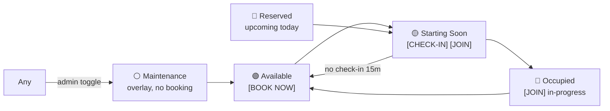
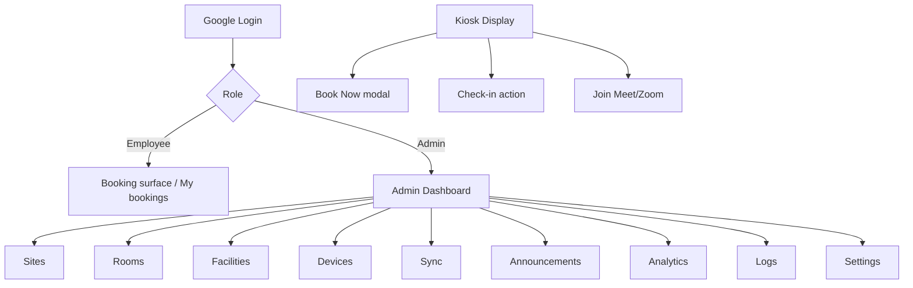

# UI/UX Wireframe

**Project:** Meeting Room Management System (MRMS)
**Document:** 13 of 19 — UI/UX Wireframe
**Status:** Draft for Approval
**Version:** 1.0
**Date:** 2026-07-20

---

## 1. Design Language

- **Google Meet-inspired**, enterprise, minimal, modern, responsive.
- **Two themes:** Light and Dark (auto by time or admin config).
- **Large, readable typography** optimized for Smart TV viewing distance.
- **Status color semantics** consistent across app:

| Status | Color intent |
|--------|--------------|
| 🟢 Available | Green |
| 🔴 Occupied | Red |
| 🟡 Starting Soon | Amber |
| ⚪ Maintenance | Neutral/Gray |
| 🔵 Reserved | Blue |

- Two distinct frontends: **Display (Kiosk)** and **Admin Panel** (+ a lightweight
  booking surface reachable from the display).

---

## 2. Display (Kiosk) — Primary Screen

Full-screen, no-scroll, TV-optimized. Realtime clock and status band dominate.

```
┌───────────────────────────────────────────────────────────────────────────┐
│  [LOGO]  PT Mitra Prodin                          Mon, 20 Jul 2026  10:42:18 │  ← header: logo + date + realtime clock
├───────────────────────────────────────────────────────────────────────────┤
│                                                                             │
│   BB — AULA UTAMA                                        ┌───────────────┐  │
│   Capacity: 20  •  Projector · VC Camera · Whiteboard    │   🟢 AVAILABLE │  │  ← big status pill
│                                                          └───────────────┘  │
│                                                                             │
│   ┌─ CURRENT MEETING ───────────────┐   ┌─ NEXT MEETING ────────────────┐  │
│   │  (none)                          │   │  Sprint Review               │  │
│   │                                  │   │  10:00–11:00 (60 min)        │  │
│   │                                  │   │  Organizer: Andi             │  │
│   │                                  │   │  andi@company.com            │  │
│   │                                  │   │  Participants: 6             │  │
│   └──────────────────────────────────┘   └──────────────────────────────┘  │
│                                                                             │
│   [ BOOK NOW ]     [ CHECK-IN ]     [ JOIN MEETING ]   ← actions (contextual)│
│                                                                             │
├───────────────────────────────────────────────────────────────────────────┤
│  TODAY'S SCHEDULE                                                           │
│   08:30–09:00  Standup            ✔ done                                    │
│   10:00–11:00  Sprint Review      Andi                                      │
│   13:00–13:30  Design Sync        Sari                                      │
│   15:00–16:00  Vendor Call        Budi (Zoom)                               │
├───────────────────────────────────────────────────────────────────────────┤
│  📢 Announcement banner (when active)                        [theme: auto]  │
└───────────────────────────────────────────────────────────────────────────┘
```

**Behavior**
- Clock ticks locally each second (NFR-PERF-4); data refreshes via WebSocket.
- Status pill and action buttons are contextual:
  - `BOOK NOW` shown when 🟢 Available.
  - `CHECK-IN` shown for organizer during grace window.
  - `JOIN MEETING`/`JOIN ZOOM` shown when link present (Doc 11).
- Maintenance state shows a clear ⚪ overlay and hides booking.

### 2.1 Display state variants



---

## 3. Booking Modal (from Display or personal device)

```
┌──────────── BOOK: BB — AULA UTAMA ────────────┐
│  Subject      [___________________________]   │
│  Purpose      [___________________________]   │
│  Date         [ 2026-07-20 ▼ ]                │
│  Start        [ 11:15 ▼ ]   End [ 11:45 ▼ ]   │
│  Participants [ add emails… + ]               │
│  Add Google Meet link  [x]                     │
│                                                │
│  ⓘ Creates a new Google Calendar event.        │
│    Editing/cancelling is done in Google        │
│    Calendar.                                   │
│                                                │
│           [ Cancel ]      [ Confirm Booking ]  │
└────────────────────────────────────────────────┘
```

- Inline availability validation; conflict → 409 message.
- Copy explicitly states no edit/delete (sets expectation per constraint).

---

## 4. Admin Panel — Layout

```
┌──────────────────────────────────────────────────────────────────────────┐
│ [LOGO] MRMS Admin        Site: [ All ▼ ]        [🔔] [☾/☀] [Admin ▼]        │
├───────────┬────────────────────────────────────────────────────────────────┤
│ SIDEBAR   │  MAIN CONTENT                                                   │
│ • Dashboard                                                                 │
│ • Sites                                                                     │
│ • Rooms                                                                     │
│ • Facilities                                                                │
│ • Devices                                                                   │
│ • Calendar Sync                                                             │
│ • Announcements                                                             │
│ • Analytics                                                                 │
│ • Logs                                                                      │
│ • Settings                                                                  │
└───────────┴────────────────────────────────────────────────────────────────┘
```

### 4.1 Admin Dashboard (overview)

```
┌ KPIs ───────────────────────────────────────────────────────────────────┐
│ [ Rooms 14 ] [ Online 12 ] [ Offline 2 ] [ Meetings today 63 ] [ NoShow 4]│
└───────────────────────────────────────────────────────────────────────────┘
┌ Live Room Grid ────────────────┐  ┌ Sync Status ───────────────────────────┐
│ BB-Aula   🟢   GP-1  🔴         │  │ Last full sync: 10:40  ✔               │
│ BB-2      🟡   GP-2  🔵         │  │ Failed: GP-3 (retrying)  ⚠             │
│ … grid of all rooms w/ status  │  │ [ Sync All ]  [ Sync Room ]            │
└─────────────────────────────────┘  └────────────────────────────────────────┘
┌ Device Health ────────────────────────────────────────────────────────────┐
│ NUC | Room | Status | CPU | RAM | Net | Chrome | Cam | Mic | TV | LastBeat  │
└────────────────────────────────────────────────────────────────────────────┘
```

### 4.2 Rooms management

```
┌ Rooms ─────────────────────────────────────────────────────────────────────┐
│ [+ New Room]     Filter: Site [▼] Status [▼]  Search […]                     │
│ Name        Site   Cap  Facilities        Status    Device   Actions        │
│ BB-Aula     BB     20   Proj,VC,WB         🟢        Online   [Edit][Maint]  │
│ GP-1        GP     8    TV,Speakerphone    🔴        Online   [Edit][Maint]  │
│ …                                                                           │
└──────────────────────────────────────────────────────────────────────────┘
```

Room edit form fields: Name, Site, Capacity, Facilities (multi-select),
Location, Google Resource ID, Display URL (generated), Photo (optional),
Maintenance toggle, Active toggle.

### 4.3 Analytics

```
┌ Analytics ───────────────────────────────────────────────────────────────┐
│ Filters: Site[▼] Room[▼] From[📅] To[📅]                     [Export CSV] │
│ ┌ Occupancy % (bar) ┐  ┌ Meetings/day (line) ┐  ┌ Peak hours (heatmap) ┐  │
│ Most used: BB-Aula   Least used: GP-2   No-shows: 23   Avg dur: 47m       │
│ ┌ Monthly trend ─────────────────────┐ ┌ Site utilization (bars) ───────┐ │
└──────────────────────────────────────────────────────────────────────────┘
```

---

## 5. Navigation Map



---

## 6. Responsive & Theming Notes

| Surface | Target | Notes |
|---------|--------|-------|
| Display | Smart TV 1080p/4K | Fixed layout, no scroll, huge type, high contrast |
| Admin | Desktop ≥1280px | Sidebar + content; tables collapse gracefully |
| Booking modal | TV + desktop + (future) mobile | Touch-friendly targets |

- Theme tokens (colors, spacing, radius, typography scale) centralized for both
  apps; dark/light via CSS variables + Tailwind.
- Accessibility: high-contrast defaults, focus states, semantic markup; full a11y
  validation requires manual assistive-tech testing (per NFR-USE-5).

---

## 7. Key UX Principles

1. Display conveys status at a glance from across the room (zero interaction).
2. Booking copy always clarifies the Google Calendar edit/cancel path.
3. Realtime everywhere; no manual refresh.
4. Admin surfaces prioritize live operational awareness (rooms, devices, sync).

---

*End of UI/UX Wireframe.*
