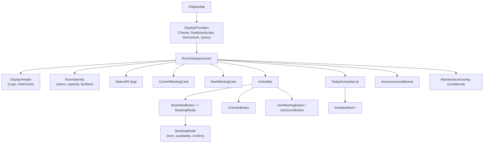
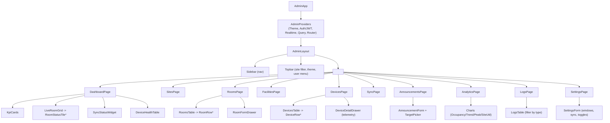

# Component Hierarchy

**Project:** Meeting Room Management System (MRMS)
**Document:** 14 of 19 — Frontend Component Hierarchy
**Status:** Draft for Approval
**Version:** 1.0
**Date:** 2026-07-20

---

## 1. Purpose

Define the React component tree for the two frontends (Display/Kiosk and Admin),
plus the shared UI/library layer. Components follow a presentational/container
split; data access goes through hooks (see Frontend Architecture, Doc 15).

---

## 2. Shared UI Library (`@mrms/ui`)

Reusable, theme-aware primitives used by both apps.

```
ui/
├── ThemeProvider          (light/dark tokens, CSS variables)
├── Button / IconButton
├── Card / Panel
├── StatusPill             (Available/Occupied/StartingSoon/Maintenance/Reserved)
├── Clock                  (local ticking realtime clock)
├── Avatar / ParticipantList
├── Modal / Drawer
├── Table / DataGrid
├── FormField / Select / DateTimePicker / EmailChips
├── Toast / Banner (announcement)
├── Badge / Tag (facility)
├── Chart wrappers (Bar/Line/Heatmap)
└── Skeleton / EmptyState / ErrorState
```

---

## 3. Display (Kiosk) App Tree



| Component | Responsibility |
|-----------|----------------|
| DisplayApp | Root; reads room id from display URL/device config |
| DisplayProviders | Theme, Socket.IO connection, device auth, React Query client |
| RoomDisplayScreen | Layout orchestration; subscribes to `room:{id}` |
| DisplayHeader | Logo + live date/clock |
| StatusPill | Large status indicator driven by server status |
| CurrentMeetingCard / NextMeetingCard | Meeting detail (organizer, participants, duration) |
| ActionBar | Contextual actions (Book/Check-In/Join) |
| BookingModal | Create booking (calls POST /bookings) |
| TodayScheduleList | Chronological day view |
| AnnouncementBanner | Shows scoped announcements |
| MaintenanceOverlay | Renders when room in maintenance |

---

## 4. Admin App Tree



| Page | Key components | Data |
|------|----------------|------|
| Dashboard | KpiCards, LiveRoomGrid, SyncStatusWidget, DeviceHealthTable | `/analytics/summary`, `/devices`, `/sync/status`, WS |
| Sites | SitesTable, SiteForm | `/sites` |
| Rooms | RoomsTable, RoomFormDrawer | `/rooms`, `/facilities` |
| Facilities | FacilitiesTable, FacilityForm | `/facilities` |
| Devices | DevicesTable, DeviceDetailDrawer | `/devices`, WS `device.status` |
| Calendar Sync | SyncStatusWidget, SyncControls | `/sync/status`, `/sync/*` |
| Announcements | AnnouncementForm, TargetPicker, list | `/announcements` |
| Analytics | Charts, filters, export | `/analytics/summary`, `/analytics/trends` |
| Logs | LogsTable, filters | `/logs` |
| Settings | SettingsForm | `/settings` |

---

## 5. Cross-Cutting Frontend Concerns

| Concern | Component/Hook |
|---------|----------------|
| Realtime | `RealtimeProvider` + `useRoomStatus`, `useDeviceEvents` |
| Data fetching | React Query hooks per resource (`useRooms`, `useAnalytics`…) |
| Auth (admin) | `AuthProvider`, `useAuth`, `RequireRole` route guard |
| Device auth (display) | `DeviceAuthProvider` (token from config) |
| Theme | `ThemeProvider`, `useTheme` |
| Errors | `ErrorBoundary`, `ErrorState`, toast surfacing |
| i18n (forward) | `I18nProvider` (strings externalized) |

---

## 6. Component Conventions

- **Presentational** components are pure (props in, UI out); **container**
  components/hooks own data + side effects.
- Status semantics are centralized in `StatusPill` and a `statusColor` token map.
- All meeting time rendering uses a shared `formatTime(tz)` util respecting
  `Site.timezone`.
- Buttons in `ActionBar` are declaratively driven by the server-provided status +
  meeting link fields (no client-side status guessing).

---

*End of Component Hierarchy.*
