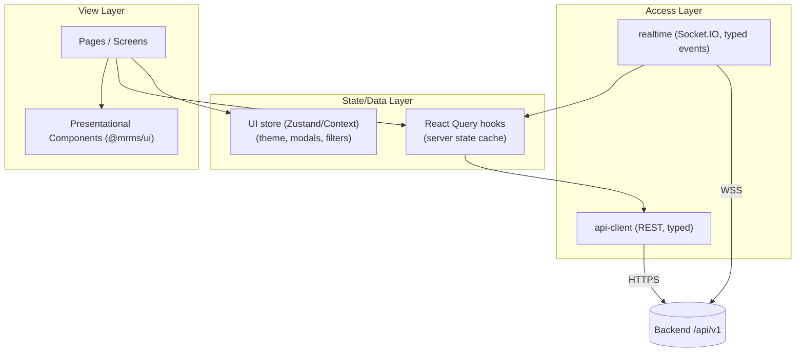

# Frontend Architecture

**Project:** Meeting Room Management System (MRMS)
**Document:** 15 of 19 — Frontend Architecture
**Status:** Draft for Approval
**Version:** 1.0
**Date:** 2026-07-20

---

## 1. Overview

Two React single-page applications share a common UI library and API/realtime
layer:

| App | Purpose | Auth | Optimized for |
|-----|---------|------|---------------|
| **Display (Kiosk)** | Room-specific fullscreen display | Device token | Smart TV, zero interaction |
| **Admin Panel** | Configuration, monitoring, analytics | Google OAuth JWT | Desktop |

Stack: **React + TypeScript + Vite + TailwindCSS**. State/data via **React Query**
(server state) + lightweight local state (Zustand/Context). Realtime via
**Socket.IO client**.

---

## 2. Monorepo Layout (frontend portion)

```
frontend/
├── apps/
│   ├── display/        # Kiosk SPA (Vite)
│   └── admin/          # Admin SPA (Vite)
├── packages/
│   ├── ui/             # shared component library (@mrms/ui)
│   ├── api-client/     # typed REST client (generated from OpenAPI)
│   ├── realtime/       # Socket.IO client + typed events
│   ├── hooks/          # shared React Query hooks
│   ├── types/          # shared DTO/domain types (shared with backend contracts)
│   └── config/         # eslint, tsconfig, tailwind preset
└── package.json        # workspaces (pnpm/npm)
```

> `api-client` and `types` are generated/derived from the backend OpenAPI +
> AsyncAPI so contracts stay in sync (single source of API truth).

---

## 3. Layered Frontend Design



- **Server state** (rooms, meetings, analytics) lives in React Query with cache
  keys per resource; **WebSocket events invalidate/patch** query caches so the UI
  updates in realtime without refetch storms.
- **UI state** (open modal, active filters, theme) lives in a small store.

---

## 4. Realtime Strategy

| Aspect | Approach |
|--------|----------|
| Connection | Single Socket.IO connection per app via `RealtimeProvider` |
| Display subscription | Auto-subscribe `room:{id}` + `site:{id}` + `global` on connect |
| Admin subscription | `admin` + `global` (+ selected site) |
| Event handling | Typed handlers map events → React Query cache updates |
| Reconnect | Exponential backoff; on reconnect emit `resync` to refresh state (NFR-AVAIL-3) |
| Degradation | If socket down, fall back to periodic REST polling; show staleness banner |

Example event→cache mapping:

| WS event | Cache action |
|----------|--------------|
| `room.status` | setQueryData(`['room-status', roomId]`) |
| `calendar.updated` | invalidate(`['room-schedule', roomId]`) |
| `device.status` | patch(`['devices']` row) |
| `announcement` | push to announcement store/banner |

---

## 5. Display App Specifics

- **Boot:** reads room id + device token from the display URL/kiosk config
  (`?room={id}&token=…` or injected config), connects realtime, fetches initial
  status/schedule.
- **Zero-interaction:** renders and updates without input; actions optional.
- **Local clock:** ticks each second independent of network (NFR-PERF-4).
- **Resilience:** shows last-known schedule from cache and a staleness/offline
  banner when backend/Google unavailable (NFR-AVAIL-2).
- **Conferencing:** Join buttons trigger the launch flow in Doc 11; return-to-
  display driven by `meeting.finished`.
- **Kiosk hardening:** intended to run under Chrome kiosk policy (deployment).

---

## 6. Admin App Specifics

- **Auth:** OAuth login (Doc 12); `RequireRole` guards admin routes; JWT attached
  by `api-client` interceptor; refresh handled transparently.
- **Routing:** React Router with lazy-loaded route chunks per page.
- **Data tables:** server-driven pagination/filtering via query params.
- **Live dashboard:** combines REST snapshots with WS live patches.
- **Export:** analytics CSV export (client triggers API export/formats data).

---

## 7. Styling & Theming

- Tailwind with a shared **preset** (colors, spacing, typography scale, radii).
- **Design tokens** as CSS variables enable light/dark switch without reflow.
- Status color map centralized; consumed by `StatusPill` and charts.
- TV scaling: display uses larger base font + rem-based scale; `clamp()` for
  fluid sizing across 1080p/4K.

---

## 8. Performance

| Concern | Technique |
|---------|-----------|
| Fast first paint (kiosk) | Vite build, code-split, preloaded critical CSS |
| Realtime efficiency | Patch caches instead of refetch; scoped subscriptions |
| Long-running display | Avoid memory leaks: cleanup timers/subscriptions; virtualize long lists |
| Admin tables | Virtualized/paginated grids |
| Asset caching | Nginx cache headers for static assets |

---

## 9. Quality & Tooling

| Concern | Tool |
|---------|------|
| Language | TypeScript strict |
| Lint/format | ESLint + Prettier (shared config) |
| Unit/component tests | Vitest + React Testing Library |
| E2E (later) | Playwright (kiosk + admin critical flows) |
| Type-safe API | Generated client from OpenAPI |
| CI gates | typecheck, lint, test on PR |

---

## 10. Error Handling & UX States

- Global `ErrorBoundary` per app; route-level fallbacks.
- Every data view supports **loading (skeleton)**, **empty**, and **error**
  states.
- Booking errors surface actionable messages (conflict, maintenance, Google
  failure) mapped from API error codes (Doc 09 §5).

---

*End of Frontend Architecture.*
