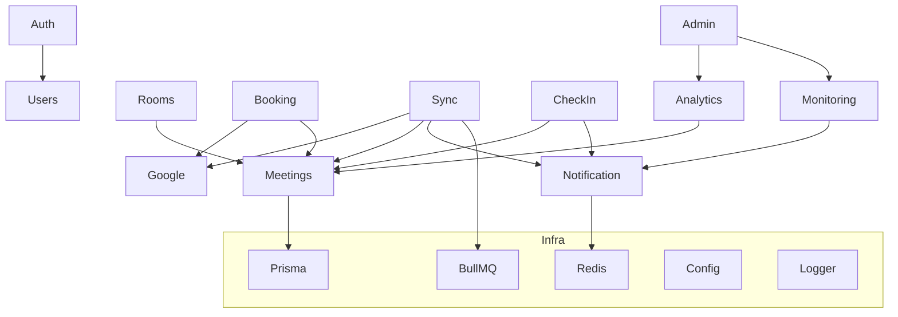
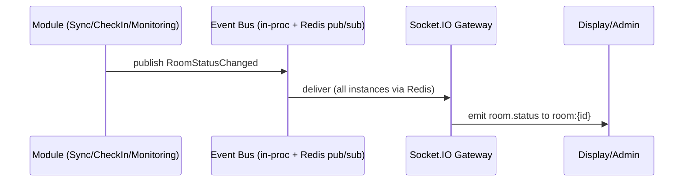

# Backend Architecture

**Project:** Meeting Room Management System (MRMS)
**Document:** 16 of 19 — Backend Architecture
**Status:** Draft for Approval
**Version:** 1.0
**Date:** 2026-07-20

---

## 1. Overview

The backend is a **NestJS** application (Node.js/TypeScript) built with
**Clean Architecture + DDD**, the **Repository Pattern**, and **SOLID**. It
exposes a **REST API** and a **WebSocket gateway**, offloads long-running/external
work to **BullMQ** workers, persists to **PostgreSQL via Prisma**, and uses
**Redis** for caching, queues, and Socket.IO scale-out.

Guiding rules (from earlier docs):
- Google Calendar is the source of truth; the app reads and **creates** events
  only (no edit/delete).
- Room status is computed server-side and pushed in realtime.
- External I/O is wrapped by an Anti-Corruption Layer and executed asynchronously.

---

## 2. Module Map (NestJS modules ≈ DDD bounded contexts)

| Module | Responsibility | Depends on |
|--------|----------------|------------|
| `AuthModule` | Google OAuth, JWT, RBAC guards, sessions | Users, Config |
| `UsersModule` | User profile, role management | Prisma |
| `SitesModule` | Site CRUD | Prisma |
| `RoomsModule` | Room/facility CRUD, maintenance, status expose | Prisma, Meetings |
| `GoogleModule` | Calendar client (ACL), OAuth token mgmt, watch channels | Config |
| `SyncModule` | Incremental sync, cache upsert, sync status | Google, Rooms, Realtime, Queue |
| `BookingModule` | Create booking (create-only Google event) | Google, Rooms, Meetings |
| `MeetingsModule` | Meeting cache queries, status computation (domain service) | Prisma, CheckIn |
| `CheckInModule` | Check-in, no-show sweep | Meetings, Realtime, Queue |
| `MonitoringModule` | Device registration, heartbeat ingest, health | Prisma, Realtime |
| `AnalyticsModule` | KPI computation, daily rollups, trends | Prisma, Queue |
| `NotificationModule` | WebSocket gateway, announcements, event fan-out | Realtime infra |
| `AdminModule` | Aggregates admin ops (logs, settings) | Many (read) |
| Shared: `PrismaModule`, `RedisModule`, `QueueModule`, `ConfigModule`, `LoggerModule` | Cross-cutting infra | — |



---

## 3. Clean Architecture Inside a Module

Each module is internally layered. Example: `BookingModule`.

```
booking/
├── domain/
│   ├── entities/ (Booking, TimeRange VO)
│   ├── services/ (ConflictPolicy)
│   └── errors/   (RoomNotAvailableError…)
├── application/
│   ├── use-cases/ (CreateBookingUseCase, ListBookingsUseCase)
│   └── ports/     (BookingRepositoryPort, CalendarGatewayPort)
├── infrastructure/
│   ├── repositories/ (PrismaBookingRepository implements port)
│   └── gateways/     (GoogleCalendarGateway implements port)
└── interface/
    ├── booking.controller.ts (REST)
    └── dto/ (CreateBookingDto…)
```

**Dependency rule:** `interface → application → domain`; `infrastructure`
implements `application` ports. Domain has zero framework imports. Ports are
injected via Nest DI tokens, enabling test doubles.

---

## 4. Request Pipeline (REST)

```mermaid
flowchart LR
    In[HTTP request] --> Guard[AuthGuard + RolesGuard]
    Guard --> Pipe[ValidationPipe (DTO)]
    Pipe --> Ctrl[Controller]
    Ctrl --> UC[Use Case]
    UC --> Repo[Repository Port -> Prisma]
    UC --> GW[Gateway Port -> Google ACL]
    UC --> Ev[Domain events -> Notification/Queue]
    Ctrl --> Intc[Interceptors: logging, correlationId, transform]
    Intc --> Out[HTTP response / error envelope]
```

Cross-cutting: exception filter maps domain errors → error envelope (Doc 09 §5);
interceptors add correlation IDs and structured logs.

---

## 5. Realtime Gateway

- `NotificationModule` hosts the **Socket.IO gateway** at `/realtime`.
- **Redis adapter** enables multi-instance fan-out (NFR-SCALE-2).
- Auth on handshake: JWT (users/admin) or device token (displays).
- Rooms/channels: `room:{id}`, `site:{id}`, `global`, `admin` (Doc 09 §4).
- Other modules emit domain events → a thin event bus → gateway broadcasts.



---

## 6. Background Jobs (BullMQ)

| Queue | Job | Trigger | Action |
|-------|-----|---------|--------|
| `sync` | `syncRoom` | schedule + push + manual | Incremental calendar sync, cache upsert, emit events |
| `sync` | `renewWatch` | schedule | Renew Google watch channels before expiry |
| `checkin` | `noShowSweep` | interval (e.g., 30s) | Mark PENDING past grace → NO_SHOW, release room, emit event |
| `analytics` | `rollupDaily` | nightly + on demand | Build `AnalyticsDaily` from cache + check-ins |
| `monitoring` | `deviceOfflineSweep` | interval | Flag devices with stale heartbeat OFFLINE |
| `retention` | `pruneTelemetry` | nightly | Prune old heartbeats per policy |

Workers are separate processes sharing the domain/application code, scaled
independently by queue depth (NFR-SCALE-4).

---

## 7. Status Computation Service (Domain)

`MeetingsModule` hosts `RoomStatusService` implementing the algorithm in Doc 04
§6. It is **pure** (inputs: cached meetings, check-in state, maintenance flag,
now, settings) and reused by REST (`/rooms/{id}/status`), realtime emission, and
the no-show sweep. This guarantees a single authoritative definition of status.

---

## 8. Persistence & Transactions

- **Prisma** as the repository implementation behind ports.
- Transactions for: booking record write, check-in state transitions, no-show
  release (NFR-DATA-3).
- Read models for analytics use pre-aggregated `AnalyticsDaily` for speed.
- Meeting cache upserts are idempotent keyed by `(roomId, googleEventId)`.

---

## 9. Configuration & Settings

| Source | Contents |
|--------|----------|
| Env (`ConfigModule`) | secrets, DB/Redis URLs, Google creds, JWT keys |
| DB `Setting` table | runtime-tunable: status windows, sync interval, feature toggles |

Runtime settings are cached in Redis and hot-reloadable so admins can change
behavior without redeploy.

---

## 10. Cross-Cutting Concerns

| Concern | Implementation |
|---------|----------------|
| Logging | Nest logger → structured JSON, correlation IDs (NFR-OBS-1) |
| Errors | Global exception filter → error envelope |
| Validation | `class-validator` DTOs + `ValidationPipe` |
| Security | Guards (JWT/device/roles), rate limiting, HTTPS via Nginx |
| Resilience | Retry/backoff on Google; circuit breaker; per-room isolation |
| Health | `/health` liveness/readiness; queue + DB + Redis checks |
| Audit | Interceptor writes `SystemLog` for state-changing admin actions |

---

## 11. Testing Strategy

| Level | Scope | Tooling |
|-------|-------|---------|
| Unit | Domain services, use cases (ports mocked) | Jest |
| Integration | Repositories against test PostgreSQL, queue jobs | Jest + Testcontainers |
| Contract | REST via supertest against OpenAPI; WS event contracts | Jest + supertest |
| E2E (later) | Full flows incl. Google sandbox/mock | Jest/Playwright |

Domain purity + ports make unit testing fast and Google-free.

---

## 12. Deployment (backend)

- Dockerized: `api` (REST+gateway) and `worker` images from the same codebase.
- Compose (v1) orchestrates api, worker, postgres, redis; Nginx in front.
- Horizontal scaling: multiple `api` and `worker` replicas; Redis-backed WS + queues.
- Migrations via Prisma Migrate on deploy.

---

*End of Backend Architecture.*
