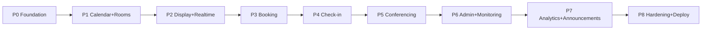

# Development Roadmap

**Project:** Meeting Room Management System (MRMS)
**Document:** 18 of 19 — Development Roadmap
**Status:** Draft for Approval
**Version:** 1.0
**Date:** 2026-07-20

---

## 1. Approach

Module-by-module delivery following the architecture (Docs 04, 16, 17). Each
phase produces a working, testable increment. The **implementation gate**
(brief step 20) applies before Phase 1 begins: all design documents (01–19) must
be approved first.

Sequencing principle: build the **foundation → source-of-truth read path →
display → booking → check-in → admin/monitoring → analytics → hardening**, so a
visible room display (the core value) appears early.

---

## 2. Phases Overview

| Phase | Theme | Primary modules | Outcome |
|-------|-------|-----------------|---------|
| P0 | Foundation & scaffolding | Monorepo, infra, Prisma, Auth base | Deployable skeleton, DB, login |
| P1 | Calendar read + Rooms | Google ACL, Sync, Rooms, Meetings/Status | Cached schedule + computed status via API |
| P2 | Display (Kiosk) + Realtime | Notification (WS), Display SPA | Live room display on NUC |
| P3 | Booking | Booking (create-only), Booking UI | Create Google events from app |
| P4 | Check-in + No-show | CheckIn, sweeps, display actions | Active/no-show lifecycle |
| P5 | Conferencing | Meet/Zoom launch, kiosk controller | Join Meet/Zoom + auto return |
| P6 | Admin Panel + Monitoring | Admin, Monitoring, device agent | Central config + device health |
| P7 | Analytics + Announcements | Analytics, Announcements | Dashboards, trends, broadcasts |
| P8 | Hardening & Deployment | Security, perf, resilience, docs | Production-ready on-prem release |

---

## 3. Phase Detail

### P0 — Foundation & Scaffolding
- Monorepo (pnpm), shared configs (eslint/tsconfig/tailwind), CI gates.
- Infra: Docker images (api/worker/web), Nginx (TLS + WS upgrade), compose,
  PostgreSQL + Redis.
- Prisma schema (Doc 08) + migrations + seed (sites BB/GP/Jembrana, facilities,
  settings, bootstrap admin).
- AuthModule: Google OAuth login, JWT issue/refresh, RBAC guards; device-token
  scaffolding.
- **Exit criteria:** login works; health checks green; DB seeded; CI passing.

### P1 — Calendar Read Path + Rooms
- GoogleModule ACL (read + create client, token mgmt), SyncModule (incremental
  sync, cache upsert, sync status), watch-channel scaffold.
- Rooms/Facilities/Sites CRUD; MeetingsModule + `RoomStatusService`.
- REST: `/rooms`, `/rooms/{id}/schedule`, `/rooms/{id}/status`, `/sync/*`.
- **Exit criteria:** a room's real Google schedule appears via API with correct
  computed status; manual + scheduled sync work.

### P2 — Display (Kiosk) + Realtime
- NotificationModule Socket.IO gateway + Redis adapter; event bus; emit
  `room.status`, `calendar.updated`.
- Display SPA: RoomDisplayScreen, header/clock, status pill, current/next,
  today's schedule, realtime updates, offline/staleness handling.
- Kiosk config (room id + device token from URL).
- **Exit criteria:** NUC in kiosk shows live, auto-updating room display.

### P3 — Booking (create-only)
- BookingModule: conflict pre-check, `events.insert` via ACL, booking record,
  link-back on sync; idempotency.
- BookingModal UI + availability validation + Google-cancel messaging.
- **Exit criteria:** booking creates a Google event, display reflects it after
  sync; no edit/delete anywhere.

### P4 — Check-in + No-show
- CheckInModule: check-in endpoint (PostgreSQL only), grace deadline, no-show
  sweep worker; status integration; realtime `meeting.started/noshow`.
- Display Check-In action for organizer.
- **Exit criteria:** check-in flips to Occupied; no-show after grace auto-releases
  and updates analytics inputs; Calendar untouched.

### P5 — Conferencing (Meet/Zoom)
- Join button logic; Meet launch in new window; backend `meeting.finished` drives
  auto-close/return; Zoom launch; kiosk controller approach finalized.
- **Exit criteria:** Join Meeting/Zoom works on NUC; returns to display at end.

### P6 — Admin Panel + Monitoring
- Admin SPA shell (auth, layout, routing), Dashboard, Sites/Rooms/Facilities
  management, Sync page, Settings.
- MonitoringModule: heartbeat ingest, device offline sweep; device agent on NUC;
  Devices page + realtime `device.status`.
- **Exit criteria:** admins manage config centrally; device health visible live.

### P7 — Analytics + Announcements
- AnalyticsModule: daily rollups, KPIs, trends, filters, CSV export; Analytics UI.
- AnnouncementsModule: create/target/broadcast; display banner.
- **Exit criteria:** dashboards show utilization/occupancy/peak/no-show/trends;
  announcements reach targeted displays in realtime.

### P8 — Hardening & Deployment
- Security review (RBAC, rate limits, secrets, token encryption), performance and
  load testing to NFR targets, resilience/failover, retention jobs, backups,
  observability, runbooks, kiosk hardening, UAT and pilot rollout per site.
- **Exit criteria:** NFRs met/verified; production on-prem deployment; pilot then
  full rollout (BB → GP → Jembrana).

---

## 4. Dependency Highlights

| Depends on | Needed by |
|------------|-----------|
| P0 Auth + DB | everything |
| P1 Sync/Status | Display, Booking, Check-in, Analytics |
| P2 Realtime | Display, Monitoring, Announcements |
| P3 Booking | full meeting lifecycle demo |
| P4 Check-in | Analytics (no-show, occupancy) |
| P6 Monitoring | operational readiness |

---

## 5. Milestones

| Milestone | Marks completion of |
|-----------|---------------------|
| M1 — Skeleton Live | P0 |
| M2 — Read-only Schedule API | P1 |
| M3 — Live Room Display (core value) | P2 |
| M4 — In-app Booking | P3 |
| M5 — Full Meeting Lifecycle | P4 + P5 |
| M6 — Central Administration & Monitoring | P6 |
| M7 — Insights & Comms | P7 |
| M8 — Production Release | P8 |

---

## 6. Cross-Cutting Workstreams (continuous)

- **Testing** (unit/integration/contract) alongside each module.
- **Security & audit** logging from P0, deep review in P8.
- **Docs** kept in sync (OpenAPI/AsyncAPI generated).
- **Observability** (structured logs, health, queue metrics) from P0.

---

## 7. Risk-Driven Ordering Notes

- Google integration (P1) is highest-risk external dependency → tackled early to
  de-risk sync/quotas before UI depends on it.
- Realtime scale-out (P2) validated before layering many displays.
- Conferencing return-to-display (P5) validated on real NUC hardware early in
  that phase due to kiosk-control uncertainty (Doc 11 §6).

---

*End of Development Roadmap.*
