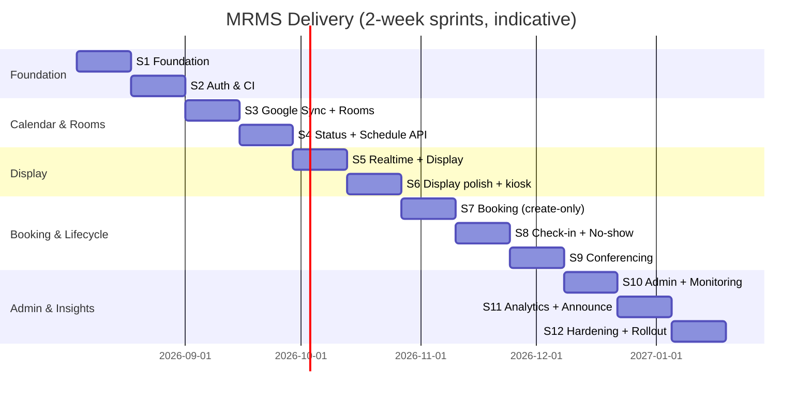

# Sprint Planning

**Project:** Meeting Room Management System (MRMS)
**Document:** 19 of 19 — Sprint Planning
**Status:** Draft for Approval
**Version:** 1.0
**Date:** 2026-07-20

---

## 1. Cadence & Conventions

- **Sprint length:** 2 weeks.
- **Estimation:** story points (Fibonacci); indicative points shown, to be
  refined in planning with the delivery team.
- **Definition of Done (DoD):** code + tests (unit/integration) passing, lint/
  typecheck green, API/event contracts updated (OpenAPI/AsyncAPI), reviewed,
  merged, deployed to the on-prem staging environment, acceptance criteria met.
- Sprints map to roadmap phases (Doc 18). Timeline is indicative; adjust to team
  size/velocity.

---

## 2. Sprint Timeline (indicative)

---

## 3. Sprint Backlogs

### Sprint 1 — Foundation (Phase P0)
| Story | Pts |
|-------|-----|
| Monorepo + workspaces + shared configs (eslint/tsconfig/tailwind) | 5 |
| Docker images (api/worker/web) + Nginx (TLS, WS upgrade) + compose | 8 |
| PostgreSQL + Redis provisioning; env/secret management | 3 |
| Prisma schema (Doc 08) + initial migration | 5 |
| Seed: sites (BB/GP/Jembrana), facilities, settings, bootstrap admin | 3 |
| Health/readiness endpoints; structured logging + correlationId | 3 |
**Goal / accept:** stack boots via compose; health green; DB seeded; CI runs.

### Sprint 2 — Auth & CI (Phase P0)
| Story | Pts |
|-------|-----|
| Google OAuth login (auth-code), JWT issue + refresh rotation | 8 |
| Role resolution (admin allowlist/domain) + RolesGuard | 5 |
| Device-token auth scaffold (issue/verify, hashed) | 5 |
| `/me`, `/auth/*` endpoints + audit logging of auth events | 3 |
| CI gates: typecheck/lint/test; OpenAPI generation pipeline | 5 |
**Accept:** admin/employee login with correct roles; device token verified; audit entries written.

### Sprint 3 — Google Sync + Rooms (Phase P1)
| Story | Pts |
|-------|-----|
| GoogleModule ACL: read + create clients, token mgmt (encrypted) | 8 |
| SyncModule: incremental sync (syncToken), cache upsert, mapping (Doc 10) | 13 |
| Sites/Rooms/Facilities CRUD (+ maintenance toggle) | 8 |
| SyncState + `/sync/*` (manual + scheduled) + sync status | 5 |
**Accept:** a room's Google events populate MeetingCache; manual+scheduled sync work; failures surfaced.

### Sprint 4 — Status + Schedule API (Phase P1)
| Story | Pts |
|-------|-----|
| `RoomStatusService` (pure) per Doc 04 §6 + unit tests | 8 |
| `/rooms/{id}/schedule` + `/rooms/{id}/status` | 5 |
| Watch-channel register/renew (push) with poll fallback | 8 |
| Zoom/Meet link extraction + participants mapping | 5 |
**Accept:** correct computed status across all variants; schedule endpoint returns current/next/today.

### Sprint 5 — Realtime + Display (Phase P2)
| Story | Pts |
|-------|-----|
| Socket.IO gateway + Redis adapter + auth on handshake | 8 |
| Event bus + emit `room.status`, `calendar.updated` | 5 |
| Display SPA shell (providers, RoomDisplayScreen), header/clock | 8 |
| Status pill, current/next cards, today schedule, realtime binding | 8 |
**Accept:** NUC kiosk shows a live, auto-updating room display.

### Sprint 6 — Display Polish + Kiosk (Phase P2)
| Story | Pts |
|-------|-----|
| Offline/staleness handling + reconnect resync | 5 |
| Theming (light/dark), TV typography scaling, maintenance overlay | 5 |
| Announcement banner placeholder; empty/error states | 3 |
| Kiosk config parsing + Chrome kiosk/autostart guidance (infrastructure/kiosk) | 5 |
**Accept:** resilient display; readable on TV; recovers from disconnects.

### Sprint 7 — Booking (Phase P3)
| Story | Pts |
|-------|-----|
| BookingModule: conflict pre-check + `events.insert` + idempotency | 13 |
| Booking record + link-back on sync (googleEventId) | 5 |
| BookingModal UI + availability validation + Google-cancel copy | 8 |
| Booking error mapping (409/403/422/502) + audit | 3 |
**Accept:** booking creates a Google event; display reflects post-sync; no edit/delete paths exist.

### Sprint 8 — Check-in + No-show (Phase P4)
| Story | Pts |
|-------|-----|
| Check-in endpoint (PostgreSQL only) + transitions | 8 |
| No-show sweep worker (grace deadline) + release + events | 8 |
| Status integration (Occupied/Reserved/back to Available) | 5 |
| Display Check-In action (organizer) | 5 |
**Accept:** check-in → Occupied; no-show after 15m auto-releases; analytics inputs updated; Calendar untouched.

### Sprint 9 — Conferencing (Phase P5)
| Story | Pts |
|-------|-----|
| Join button logic (Meet/Zoom availability) | 3 |
| Meet launch (new window) + backend `meeting.finished` auto-close/return | 8 |
| Zoom launch + return-to-display | 5 |
| Kiosk controller decision + implementation (window control) | 8 |
**Accept:** Join Meet/Zoom works on NUC; auto-returns to display at meeting end.

### Sprint 10 — Admin + Monitoring (Phase P6)
| Story | Pts |
|-------|-----|
| Admin SPA shell (auth, layout, routing, RequireRole) | 5 |
| Dashboard (KPIs, live room grid, sync widget) | 8 |
| Sites/Rooms/Facilities/Settings management UI | 8 |
| MonitoringModule (heartbeat ingest, offline sweep) + device agent | 8 |
| Devices page + realtime device.status | 5 |
**Accept:** admins manage config centrally; device health visible and live.

### Sprint 11 — Analytics + Announcements (Phase P7)
| Story | Pts |
|-------|-----|
| Analytics rollups (daily) + KPIs + trends + filters | 13 |
| Analytics UI (charts, export CSV) | 8 |
| Announcements create/target/broadcast + display banner | 8 |
| Logs page (system/activity/audit) | 3 |
**Accept:** dashboards show occupancy/peak/no-show/most-least-used/trends; announcements reach targeted displays.

### Sprint 12 — Hardening + Rollout (Phase P8)
| Story | Pts |
|-------|-----|
| Security review + rate limiting + secret/token encryption audit | 8 |
| Load/latency testing to NFR targets; tuning | 8 |
| Resilience (Google outage, reconnect), backups, retention jobs | 5 |
| Observability dashboards, runbooks, kiosk hardening | 5 |
| UAT + pilot (one BB room) → phased rollout BB→GP→Jembrana | 8 |
**Accept:** NFRs verified; production on-prem release; sites rolled out.

---

## 4. Team & Roles (suggested)

| Role | Focus |
|------|-------|
| Backend engineer(s) | NestJS modules, sync, workers, integrations |
| Frontend engineer(s) | Display + Admin SPAs, shared UI |
| Full-stack/Integrations | Google Calendar/OAuth, conferencing, kiosk |
| DevOps | Docker/Nginx/compose, CI/CD, on-prem deploy, monitoring |
| QA | Test strategy, contract/E2E, UAT |
| Product/PO | Backlog, acceptance, stakeholder open-questions (PRD §15) |

---

## 5. Ceremonies

- Sprint Planning, Daily Standup, Backlog Refinement (mid-sprint), Sprint Review
  (demo the increment), Retrospective.
- **Per-phase gate:** demo + acceptance against the phase exit criteria (Doc 18).

---

## 6. Assumptions & Adjustments

- Timeline/points are indicative and assume a small cross-functional team; scale
  sprints to actual velocity.
- Open questions in PRD §15 (touch interaction, timing windows, sync trigger
  policy, retention) should be resolved before/at Sprint 1 planning as they
  affect P2–P4 and P8.
- Google API access, Resource IDs, and NUC hardware must be available by Sprint 3
  (sync) and Sprint 5/9 (display/conferencing on real devices).

---

*End of Sprint Planning.*
