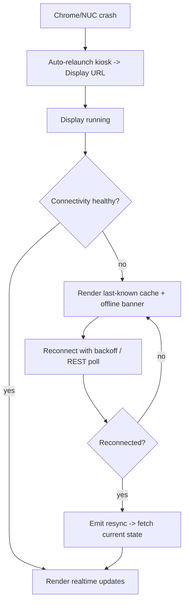

# Display Client Recovery Guide

> **Purpose:** Define automatic and manual recovery for the room display (Intel NUC + Chrome kiosk) across failure scenarios.
> **Scope:** Display SPA, Chrome kiosk, Intel NUC, network, WebSocket, and conferencing return-to-display.
> **Version:** 1.0
> **Author:** MRMS Engineering Team - PT Mitra Prodin
> **Last Updated:** 2026-07-20
> **Related Documents:** [Google Meet Integration Flow](11-Google-Meet-Integration-Flow.md), [Frontend Architecture](15-Frontend-Architecture.md), [Disaster Recovery](DISASTER-RECOVERY.md), [Observability](OBSERVABILITY.md), [Kiosk setup](../infrastructure/kiosk/chrome-kiosk.md)
> **References:** -

The display must be **resilient and self-healing**: rooms should always show
useful information and recover without on-site intervention where possible.

## 1. Principles

- **Zero-interaction**: the display shows status/schedule without input (D-005).
- **Graceful degradation**: on any backend/Google/network failure, show the
  **last-known cached schedule** plus a clear **offline/staleness banner** with
  the last-updated time.
- **Automatic reconnect + resync**: recover state on its own when connectivity
  returns.

## 2. Recovery Scenarios

### 2.1 Chrome Crash
- Chrome is configured to relaunch on crash (kiosk autostart); the device agent
  reports `chromeRunning=false` via heartbeat.
- On relaunch, the kiosk reopens the Display URL, re-authenticates the device
  token, and re-subscribes to `room:{id}`. Cached schedule renders immediately
  while realtime reconnects.

### 2.2 Mini PC (Intel NUC) Restart / Failure
- On restart: auto-login -> Chrome autostart -> kiosk -> Display URL (no
  interaction). See [kiosk setup](../infrastructure/kiosk/chrome-kiosk.md).
- On hardware failure: detected via missed heartbeats -> OFFLINE alert; replace
  and reimage from the provisioning image; reprovision a room-scoped device token
  (see [Disaster Recovery §3.6](DISASTER-RECOVERY.md)).

### 2.3 Internet Disconnected
- The display keeps rendering the last cached schedule with an offline banner.
- Realtime pauses; the client attempts reconnect with backoff. On restore, it
  emits `resync` and refreshes.

### 2.4 Google Calendar Unavailable
- The backend serves cached data; the display shows a staleness indicator (data
  older than the sync interval).
- No display action required; freshness returns automatically after sync recovers
  (see [Google Workspace Integration Guide §11](GOOGLE-WORKSPACE-INTEGRATION-GUIDE.md)).

### 2.5 WebSocket Disconnected
- Socket.IO client auto-reconnects with exponential backoff (NFR-AVAIL-3).
- While disconnected, the display may fall back to periodic REST polling for
  status and shows a "reconnecting" indicator.
- On reconnect, the client emits `resync` to fetch current status/schedule so it
  never stays stale after recovery.

### 2.6 Google Meet / Zoom Closed Unexpectedly
- If the conferencing window closes early, the kiosk returns to display mode.
- The authoritative return trigger remains the backend `meeting.finished` signal
  at scheduled `endTime` (+ `JOIN_AUTO_CLOSE_GRACE_MINUTES`); optional kiosk-side
  heuristics can also detect a "call ended" state (D-006,
  [Doc 11](11-Google-Meet-Integration-Flow.md)).

### 2.7 Application Restart (backend redeploy)
- During a backend restart/redeploy, the display serves cached data and shows a
  reconnecting/staleness state; it reconnects and resyncs automatically when the
  API/gateway is healthy again.

## 3. Automatic Recovery Flow

## 4. Offline Cache Strategy

- The display retains the last successfully rendered room status + today's
  schedule (in memory and/or local storage).
- The offline banner shows the **last-updated timestamp** so viewers understand
  the data may be stale.
- The local clock keeps ticking accurately (NTP-backed) even while offline
  (NFR-PERF-4).

## 5. Reconnect Strategy

- Exponential backoff with a capped interval; jitter to avoid thundering-herd on
  mass reconnect after an outage.
- Always `resync` after reconnect (do not assume missed events were buffered).
- Device continues sending heartbeats (or resumes ASAP) so the Admin Panel
  reflects true device state.

## 6. Monitoring & Alerts

- Device heartbeats drive OFFLINE/DEGRADED detection and admin alerts
  (see [Observability §6](OBSERVABILITY.md)); an unrecovered display raises an
  alert for on-site action.

## 7. On-Site Runbook (quick reference)

1. Check power/network to the NUC.
2. Confirm Chrome relaunched in kiosk on the correct Display URL.
3. If stuck: restart Chrome, then the NUC.
4. If still failing: reimage from provisioning image; reprovision device token.
5. Verify heartbeat, realtime updates, and camera/mic permissions.
