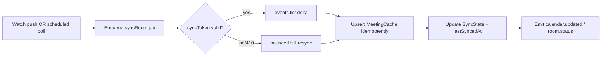

# Google Workspace Integration Guide (Operational)

> **Purpose:** Operational guide for integrating and running MRMS against Google Workspace / Calendar.
> **Scope:** OAuth, Calendar Resources, scopes, quotas, retry/backoff, incremental sync, watch channels, webhook failure handling, caching, and recovery.
> **Version:** 1.0
> **Author:** MRMS Engineering Team - PT Mitra Prodin
> **Last Updated:** 2026-07-20
> **Related Documents:** [Google Calendar Integration Design](10-Google-Calendar-Integration-Design.md), [ADR-005](adr/ADR-005-google-calendar-source-of-truth.md), [Authentication Flow](12-Authentication-Flow.md), [Security Guide](SECURITY.md), [Disaster Recovery](DISASTER-RECOVERY.md), [Configuration](CONFIGURATION.md)
> **References:** [Google Calendar API](https://developers.google.com/calendar/api), [Push notifications](https://developers.google.com/calendar/api/guides/push), [Incremental sync](https://developers.google.com/calendar/api/guides/sync)

This is the **operational** companion to the design in
[Doc 10](10-Google-Calendar-Integration-Design.md). Doc 10 remains authoritative
for the design; this guide focuses on running and recovering the integration.

## 1. Google Calendar Resources

- Each meeting room is a **Google Calendar Resource** already provisioned in
  Workspace; its identifier maps to `Room.googleResourceId`.
- Reservations for a room are events on that resource calendar - the **source of
  truth** (ADR-005).
- Admin maps each room to its resource ID via the Admin Panel (see
  [Doc 10 §1](10-Google-Calendar-Integration-Design.md)).

## 2. OAuth Flow (integration credentials)

- **User login** uses Google OAuth (see [Doc 12](12-Authentication-Flow.md)),
  separate from calendar service access.
- **Calendar access** uses a service credential (service account with
  domain-wide delegation, or a dedicated Workspace service user), abstracted
  behind the ACL. Configured via `GOOGLE_SERVICE_ACCOUNT_JSON` /
  `GOOGLE_DELEGATED_USER` (see [Configuration](CONFIGURATION.md)).

## 3. Scopes (least privilege)

- `calendar.readonly` (read events) + `calendar.events` (create events).
- **No edit/delete scope is ever requested** - this enforces the create-only rule
  at the permission level (ADR-005, [Security Guide](SECURITY.md)).

## 4. API Quotas

- Google enforces per-project and per-user rate limits. Monitor usage; a spike in
  sync volume or many rooms can approach limits (Risk R-01).
- Mitigations: incremental sync (small deltas), watch channels (fewer polls),
  per-room job spacing, and backoff. Metrics track sync duration/failures
  ([Observability](OBSERVABILITY.md)).

## 5. Retry Strategy & Exponential Backoff

- Transient failures (`403 rateLimitExceeded`, `429`, 5xx, network) are retried
  with **exponential backoff + jitter**, capped at a max attempt count.
- Per-room isolation: one room's failures do not block others.
- After max retries, mark the room's `SyncState.lastStatus = FAILED`, log with
  correlation ID, and surface in admin sync status; the display shows staleness.

## 6. Incremental Sync

- Per room, store a `syncToken`; `events.list(syncToken=...)` returns only
  changes plus a `nextSyncToken`.
- On **`410 GONE`** (invalid/expired token): clear the token and perform a
  **bounded full resync** over the sync window (`SYNC_WINDOW_DAYS`, default 14),
  then resume incremental.
- Apply changes as idempotent upserts to `MeetingCache` keyed by
  `(roomId, googleEventId)`; events with `status=cancelled` are soft-removed and
  emit `meeting.cancelled`.

## 7. Watch Channel Renewal

- Where enabled (`SYNC_USE_WATCH_CHANNELS=true`), register a **watch channel** per
  resource to receive push notifications on change.
- Channels expire; a scheduled worker renews them before `watchExpiresAt`
  (`SYNC_WATCH_RENEW_LEAD_MINUTES`, default 60). Store channel metadata in
  `SyncState`.
- A push notification only **triggers** an incremental sync job; the app never
  trusts push payload contents as data (it re-reads authoritatively).

## 8. Webhook (Push) Failure Handling

- The push endpoint (`/google/notifications`) validates the channel token before
  acting; invalid tokens are rejected and logged.
- **Missed/duplicate notifications are safe:** the scheduled incremental poll
  (`SYNC_INTERVAL_SECONDS`, default 60) guarantees convergence even if a webhook
  is missed (Risk R-19).
- If channel registration fails, fall back to **poll-only** and alert.

## 9. Caching Strategy

- `MeetingCache` (PostgreSQL) is the durable projection; Redis may cache hot
  read models (e.g., a room's day view / computed status) for fast display reads.
- Cache is **eventually consistent** with a bounded staleness (<= sync interval)
  - acceptable per [NFR-DATA-1](03-NFR-Non-Functional-Requirements.md).
- On write (booking create), the new event is reflected after the next sync; the
  UI communicates this.

## 10. Synchronization Flow (summary)

Full sequence and field mapping are in
[Doc 10 §3-4](10-Google-Calendar-Integration-Design.md).

## 11. Failure Recovery

| Situation | Recovery |
|-----------|----------|
| Rate limited | Backoff; widen interval temporarily; prioritize active rooms |
| Invalid sync token (410) | Clear token; bounded full resync |
| Watch channel lost/expired | Renew or re-register; poll fallback covers the gap |
| Google outage | Serve cache; retry; surface status; no data restore needed (SSOT) |
| Booking create fails | Return `502 GOOGLE_CREATE_FAILED`; user retries (idempotency key) |
| Credential/scope error | Alert; verify service credential + scopes; never add edit/delete |

See [Disaster Recovery §3.3](DISASTER-RECOVERY.md) for the broader Google-failure
procedure.

## 12. Operational Checklist

- [ ] Resource IDs mapped for every room.
- [ ] Service credential configured; only read+create scopes granted.
- [ ] Watch channels registered (if enabled) and renewal job scheduled.
- [ ] Sync metrics + alerts wired (last-success age, failures).
- [ ] Booking create path verified (idempotency, error mapping).
- [ ] Confirm manual-sync trigger policy (PRD open question Q4).
