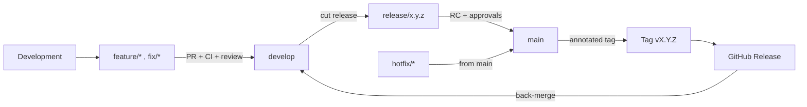

# Release Strategy

> **Purpose:** Summarize the MRMS release workflow and Semantic Versioning for GitHub governance.
> **Scope:** Branch -> release -> tag -> GitHub Release flow.
> **Version:** 1.0
> **Author:** MRMS Engineering Team - PT Mitra Prodin
> **Last Updated:** 2026-07-20
> **Related Documents:** [Release Management (authoritative)](../process/release-management.md), [Milestones](./MILESTONES.md), [Git Convention](../standards/git-convention.md), [CHANGELOG](../../CHANGELOG.md)
> **References:** [Semantic Versioning](https://semver.org/), [Keep a Changelog](https://keepachangelog.com/)

> The **authoritative** process (RC checklist, production checklist, rollback,
> hotfix) is [`docs/process/release-management.md`](../process/release-management.md).
> This page is the governance-level summary and the requested flow diagram.

## 1. Release Flow

```
Development
    |
    v
Feature Branch (feature/*, fix/*)
    |  Pull Request  (CI + review + CODEOWNERS)
    v
develop  (integration; always green)
    |  cut when scope for a version is ready
    v
Release Branch (release/x.y.z)  ---- stabilize: fix/docs/chore/test only
    |  RC checks + QA + Product + Eng approval
    v
main
    |  annotated tag
    v
Tag vX.Y.Z
    |
    v
GitHub Release  (notes generated from CHANGELOG)  ---> back-merge into develop
```



## 2. Semantic Versioning

- Format `MAJOR.MINOR.PATCH`.
- **Pre-1.0 (development):** each sprint ends with a tagged release
  (`v0.2.0` .. `v0.12.0`), culminating in `v1.0.0` (production). Breaking changes
  may land in MINOR bumps and are called out in the CHANGELOG.
- **Post-1.0:** MAJOR = breaking, MINOR = backward-compatible features,
  PATCH = fixes.
- **Release candidates** use pre-release identifiers: `v1.0.0-rc.1`.
- Tags are **annotated** and created on `main`. Docker images are pinned to the
  version tag for deterministic rollback.

## 3. GitHub Releases

Tags exist for `v0.1.0` and `v0.1.1-engineering-review`. Create GitHub Releases
from tags (notes from the CHANGELOG):

```bash
# Requires: gh auth login (admin).
gh release create v0.1.0 --title "v0.1.0 - Foundation" \
  --notes-file CHANGELOG-excerpt.md   # or --generate-notes
```

Each subsequent milestone (see [MILESTONES](./MILESTONES.md)) produces its tag and
GitHub Release as part of the release checklist in the authoritative process doc.

## 4. Where each rule lives

| Topic | Document |
|-------|----------|
| RC checklist, production checklist, rollback, hotfix | [release-management.md](../process/release-management.md) |
| Version <-> milestone mapping | [MILESTONES.md](./MILESTONES.md) + [../MILESTONES.md](../MILESTONES.md) |
| Branch naming & Git Flow | [git-convention.md](../standards/git-convention.md) |
| Changelog format | [CHANGELOG.md](../../CHANGELOG.md) |
