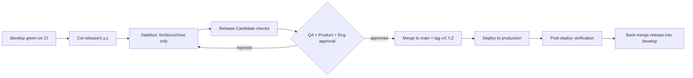

# Release Management

> **Purpose:** Define how MRMS releases are versioned, validated, approved, shipped, and rolled back.
> **Scope:** All releases (sprint releases, hotfixes) of the on-premise MRMS stack.
> **Version:** 1.0
> **Author:** MRMS Engineering Team - PT Mitra Prodin
> **Last Updated:** 2026-07-20
> **Related Documents:** [MILESTONES](../MILESTONES.md), [Git Convention](../standards/git-convention.md), [ADR-006 Docker](../adr/ADR-006-why-docker-deployment.md), [Disaster Recovery](../DISASTER-RECOVERY.md), [Operations Guide](../wiki/operations-guide.md), [CHANGELOG](../../CHANGELOG.md)
> **References:** [Semantic Versioning](https://semver.org/), [Keep a Changelog](https://keepachangelog.com/)

## 1. Versioning Strategy

- **Semantic Versioning** `MAJOR.MINOR.PATCH`.
- **Pre-1.0** during development: breaking changes may land in MINOR bumps and are
  called out explicitly in the CHANGELOG.
- Cadence (see [MILESTONES](../MILESTONES.md)): repo init = `v0.1.0`; each sprint
  ends with a tagged release (`v0.2.0` .. `v1.0.0` = production).
- **After 1.0:** MAJOR = breaking, MINOR = features (backward-compatible),
  PATCH = fixes.
- Tags are **annotated** and created on `main` at release time.

## 2. Branch -> Release Flow (Git Flow)

```
feature/* , bugfix/*  -> develop  -> release/x.y.z  -> main (tag vX.Y.Z) -> back-merge to develop
hotfix/*  ------------------------------------------> main (tag vX.Y.Z+1) -> back-merge to develop
```

## 3. Release Approval Flow



Approvers: **Engineering Lead** (technical), **QA Lead** (quality), **Product
Owner** (scope/acceptance). All three approve before merge to `main`.

## 4. Versioning of Docker Images

- Images (`mrms/api`, `mrms/worker`, `mrms/web`) are tagged with the release
  version and `latest` for the release channel.
- Production deploys pin the explicit version tag (never a floating `latest`) so
  rollback is deterministic.

## 5. Release Candidate (RC) Checklist

- [ ] `release/x.y.z` cut from a green `develop`.
- [ ] Version bumped in root `package.json` (and app manifests).
- [ ] CHANGELOG `[Unreleased]` moved into a dated `[x.y.z]` section.
- [ ] All CI checks pass (lint, typecheck, test, build, docker-build).
- [ ] Coverage meets targets (see [Testing Strategy](../TESTING-STRATEGY.md)).
- [ ] Database migrations reviewed; rollback path confirmed.
- [ ] Security review for the delta (auth/secrets/data exposure).
- [ ] Docs synchronized (docs-first); ADR/Decision-Log updated if needed.
- [ ] Deployed to **staging**; smoke + UAT performed.
- [ ] Open risks reviewed ([Risk Register](../RISK-REGISTER.md)); no High-severity
      blockers unaddressed.

## 6. Release Checklist (production)

- [ ] RC approved by Engineering, QA, and Product.
- [ ] Merge `release/x.y.z` into `main`; create annotated tag `vX.Y.Z`.
- [ ] Build + publish versioned images.
- [ ] **Backup** database before deploy (see [Disaster Recovery](../DISASTER-RECOVERY.md)).
- [ ] Apply migrations (Prisma migrate deploy).
- [ ] Deploy via Compose prod overrides (pinned image tags).
- [ ] Post-deploy verification: health endpoints green; a room display renders and
      updates in realtime; a sync cycle succeeds; device heartbeats received.
- [ ] Monitor logs/metrics for the first monitoring window.
- [ ] Back-merge `release/x.y.z` into `develop`.
- [ ] Announce release; update GitHub release notes from the CHANGELOG.

## 7. Rollback Procedure

1. **Decide**: post-deploy verification fails or a Sev-1 emerges.
2. **Application rollback**: redeploy the previous pinned image tags
   (deterministic; images are immutable).
3. **Database**: if the release included migrations:
   - Prefer a **forward fix** migration when safe.
   - If a schema rollback is required, apply the documented down-migration or
     restore from the pre-deploy backup (accepting the RPO window). See
     [Disaster Recovery](../DISASTER-RECOVERY.md) for restore steps and RTO/RPO.
4. **Verify** health + core flows after rollback.
5. **Record** the incident and root cause; add follow-up items to the backlog.

> Because Google Calendar is the source of truth and the app is create-only, an
> application rollback does not risk reservation data; the cache re-syncs.

## 8. Hotfix Process

1. Branch `hotfix/<id>-<summary>` from `main`.
2. Implement the minimal fix + test; bump PATCH version; update CHANGELOG.
3. Fast-track review (Engineering Lead + one approver).
4. Merge to `main`, tag `vX.Y.(Z+1)`, deploy.
5. Back-merge into `develop` (and any active `release/*`).
6. Post-mortem for Sev-1/Sev-2 incidents.

## 9. Release Artifacts

- Git annotated tag on `main`.
- CHANGELOG section for the version.
- Versioned Docker images.
- GitHub Release notes (generated from CHANGELOG).
- Updated docs where behavior changed.
