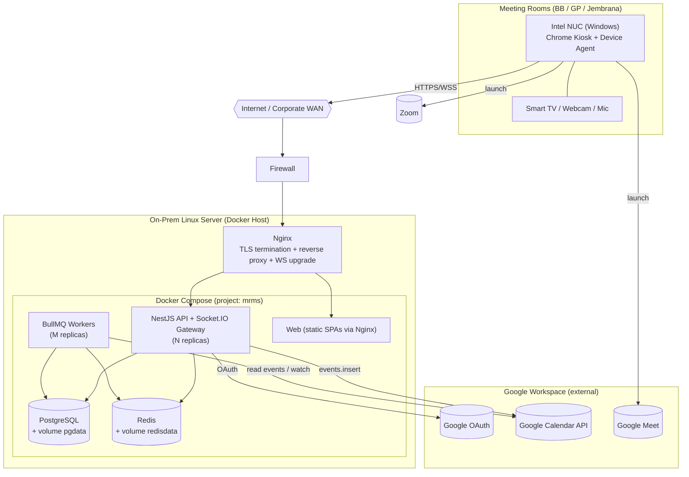
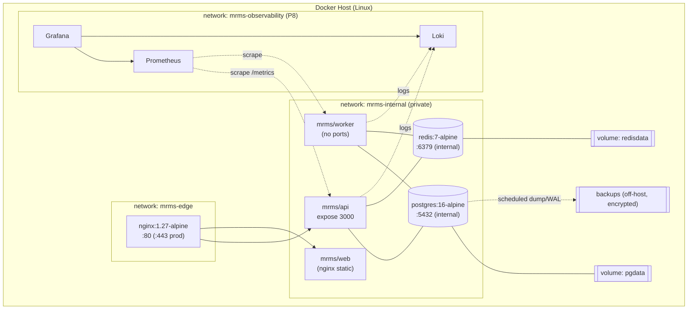

# Deployment & Infrastructure Diagrams

> **Purpose:** Deployment topology and infrastructure (containers, networks, volumes) for MRMS.
> **Scope:** On-premise Docker deployment: internet, firewall, reverse proxy, services, datastores, NUC/Chrome, Google.
> **Version:** 1.0
> **Author:** MRMS Engineering Team - PT Mitra Prodin
> **Last Updated:** 2026-07-20
> **Related Documents:** [High-Level Architecture](../06-High-Level-Architecture-Diagram.md), [ADR-006 Docker](../adr/ADR-006-why-docker-deployment.md), [Deployment Guide](../wiki/deployment-guide.md), [Disaster Recovery](../DISASTER-RECOVERY.md), [Observability](../OBSERVABILITY.md)
> **References:** -

## 1. Deployment Diagram (topology)

## 2. Infrastructure Diagram (containers, networks, volumes)

## 3. Networks

| Network | Purpose | Members |
|---------|---------|---------|
| `mrms-edge` | Public-facing entry | Nginx (only inbound surface) |
| `mrms-internal` | Private service/data traffic (not published) | API, worker, web, Postgres, Redis |
| `mrms-observability` | Metrics/logs (P8) | Prometheus, Grafana, Loki, exporters |

Only Nginx exposes ports to the host/network edge; datastores are never published
externally. Egress to Google APIs is outbound-only.

## 4. Volumes & Persistence

| Volume | Data | Backup |
|--------|------|--------|
| `pgdata` | PostgreSQL data | Daily `pg_dump` + WAL PITR, encrypted off-host (see DR) |
| `redisdata` | Redis AOF | Rebuildable; short-lived |
| backups target | DB dumps/WAL | Off-host, encrypted, retained per policy |

## 5. Notes

- Single-host Compose for v1 (ADR-006); HA/orchestrator is a documented future
  path. TLS certs + 443 are enabled in production (Phase P8).
- The observability network/stack is provisioned in Phase P8; the app is
  instrumented from Sprint 1 (metrics, logs, health).
