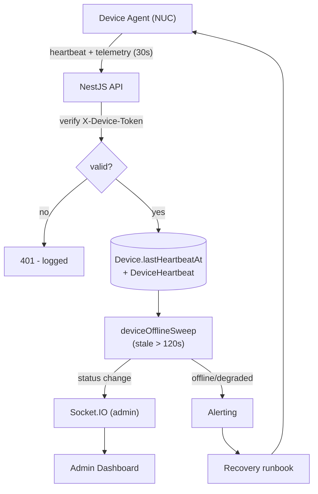

# Device Heartbeat Flow

> **Purpose:** Define the end-to-end device heartbeat pipeline from NUC to dashboard/alert/recovery.
> **Scope:** Intel NUC device agent, ingestion, persistence, offline detection, alerting, recovery.
> **Version:** 1.0
> **Author:** MRMS Engineering Team - PT Mitra Prodin
> **Last Updated:** 2026-07-20
> **Related Documents:** [Observability](../OBSERVABILITY.md), [Monitoring Dashboard](./MONITORING-DASHBOARD.md), [Display Client Recovery](../DISPLAY-CLIENT-RECOVERY.md), [Backend Architecture](../16-Backend-Architecture.md), [API Specification](../09-API-Specification.md)
> **References:** -

## 1. Pipeline

```
Mini PC (NUC device agent)
      ↓  POST /devices/{roomId}/heartbeat (X-Device-Token) every 30s
Backend API (verify token, validate telemetry)
      ↓
PostgreSQL (Device.lastHeartbeatAt updated; DeviceHeartbeat row inserted)
      ↓
deviceOfflineSweep worker (interval) - flags stale > 120s as OFFLINE
      ↓
Dashboard (Admin) - live device status via device.status (WS admin channel)
      ↓
Alert (device offline / degraded) - routed to on-call
      ↓
Recovery (Display Client Recovery runbook)
```

## 2. Flow Diagram



## 3. Telemetry Payload

Per [API Spec](../09-API-Specification.md) `POST /devices/{roomId}/heartbeat`:
CPU, RAM, storage usage; internet OK; Chrome running; display running; webcam /
microphone / TV connected; last calendar sync. Validated at ingest (ranges,
booleans); floats expected 0-100 (ERD R9).

## 4. Status Determination

- **ONLINE:** heartbeat within `DEVICE_OFFLINE_THRESHOLD_SECONDS` (120s) and
  telemetry healthy.
- **DEGRADED:** heartbeat present but a peripheral/service unhealthy (e.g., cam/
  mic/TV disconnected, Chrome/display not running, internet down).
- **OFFLINE:** no heartbeat for > threshold (sweep-detected).
- **UNKNOWN:** provisioned, no heartbeat yet.
State machine in [State Machines §5](./STATE-MACHINES.md).

## 5. Cadence & Thresholds

| Setting | Default | Purpose |
|---------|---------|---------|
| `DEVICE_HEARTBEAT_INTERVAL_SECONDS` | 30 | Agent post cadence |
| `DEVICE_OFFLINE_THRESHOLD_SECONDS` | 120 | ~4 missed beats -> OFFLINE |
| sweep interval | ~30-60s | Detect stale devices |

Threshold = ~4x interval tolerates transient blips without false positives.

## 6. Alerting & Recovery

- Offline/degraded transitions emit `device.status` (admin channel) and raise an
  alert ([Observability §5](../OBSERVABILITY.md)).
- Recovery follows the [Display Client Recovery](../DISPLAY-CLIENT-RECOVERY.md)
  runbook (power/network/Chrome/NUC; reimage if needed).

## 7. Data Retention

Raw `DeviceHeartbeat` rows are high-volume (~288k/day @ 100 rooms) and pruned by
the `retention` job; long-term trends use rollups (see
[Capacity Planning §5](./CAPACITY-PLANNING.md), [Database Strategy §6](../DATABASE-STRATEGY.md)).
