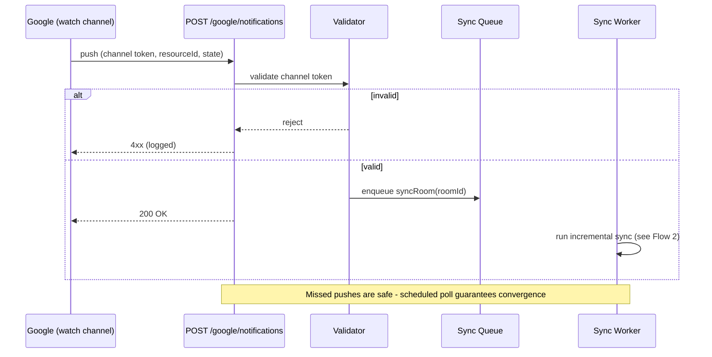
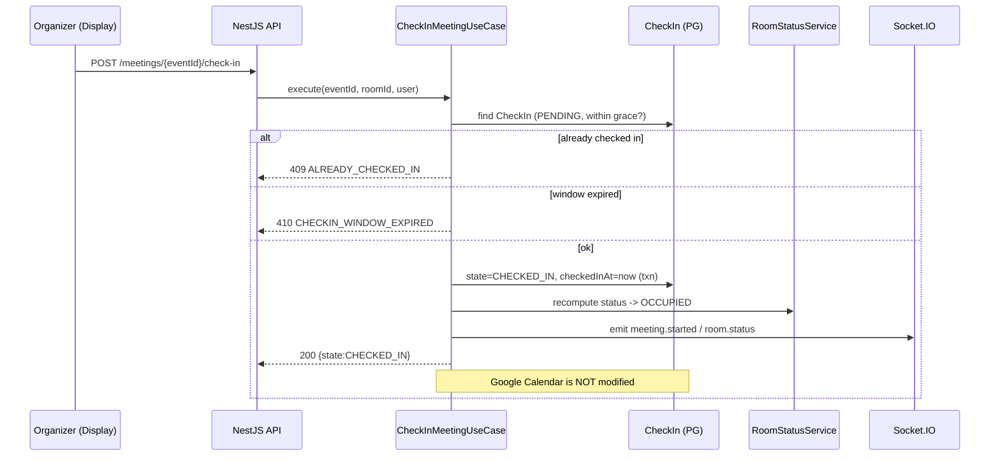
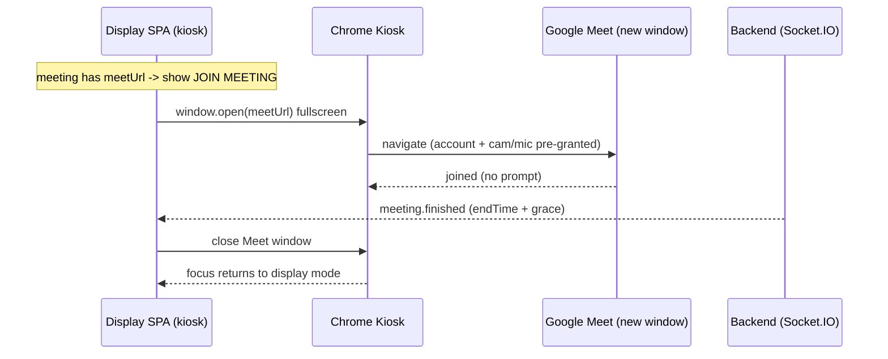
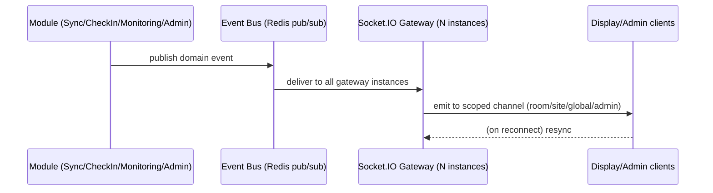
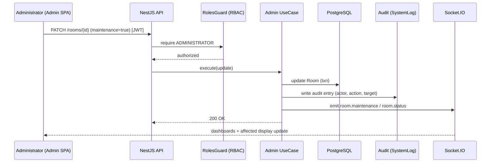

# Sequence Diagrams

> **Purpose:** End-to-end sequence diagrams for the key MRMS flows.
> **Scope:** Booking, sync, webhook, check-in, conferencing, display, notification, heartbeat, realtime, admin.
> **Version:** 1.0
> **Author:** MRMS Engineering Team - PT Mitra Prodin
> **Last Updated:** 2026-07-20
> **Related Documents:** [Software Architecture](../04-Software-Architecture.md), [Backend Architecture](../16-Backend-Architecture.md), [API Specification](../09-API-Specification.md), [Google Calendar Integration Design](../10-Google-Calendar-Integration-Design.md), [Event-Driven Flow](./EVENT-DRIVEN-FLOW.md)
> **References:** -

All diagrams use Mermaid `sequenceDiagram`.

## 1. Booking Flow (create-only)

```mermaid
sequenceDiagram
    participant U as User (Display/Admin)
    participant API as NestJS API
    participant UC as CreateBookingUseCase
    participant C as MeetingCache (PG)
    participant G as Google Calendar (ACL)
    participant Q as Sync Worker
    participant WS as Socket.IO
    U->>API: POST /bookings (Idempotency-Key)
    API->>UC: execute(dto)
    UC->>C: conflict pre-check (roomId, range)
    alt conflict
        UC-->>API: 409 ROOM_NOT_AVAILABLE
        API-->>U: error envelope
    else free
        UC->>G: events.insert (resource cal, attendees, conferenceData?)
        G-->>UC: eventId (+ Meet link)
        UC->>C: record Booking (status=CREATED)
        UC-->>API: 201 {googleEventId}
        API-->>U: 201 Created
        Q->>G: incremental sync reflects event
        Q->>C: upsert MeetingCache; link Booking
        Q->>WS: emit room.status (Reserved/Starting Soon)
        WS-->>U: display updates
    end
```

## 2. Calendar Synchronization (incremental)

```mermaid
sequenceDiagram
    participant Sch as Scheduler/Trigger
    participant Q as Sync Worker (BullMQ)
    participant S as SyncState (PG)
    participant G as Google Calendar API (ACL)
    participant C as MeetingCache (PG)
    participant WS as Socket.IO
    Sch->>Q: enqueue syncRoom(roomId)
    Q->>S: read syncToken
    alt token valid
        Q->>G: events.list(syncToken)
    else missing/410
        Q->>G: events.list(timeMin=today, singleEvents)
    end
    G-->>Q: changed events (+ nextSyncToken)
    Q->>C: upsert changes; soft-remove cancelled
    Q->>S: store nextSyncToken, lastSyncedAt, status
    Q->>WS: emit calendar.updated / room.status
```

## 3. Google Calendar Webhook (push notification)



## 4. Check-In



## 5. Join Google Meet



## 6. Display Refresh

```mermaid
sequenceDiagram
    participant NUC as Display SPA
    participant API as NestJS API
    participant R as Redis cache
    participant WS as Socket.IO
    NUC->>API: GET /rooms/{id}/status (initial)
    API->>R: read cached status
    alt cache hit
        R-->>API: status
    else miss
        API->>API: compute + cache (RoomStatusService)
    end
    API-->>NUC: status + schedule
    NUC->>WS: subscribe room:{id}
    WS-->>NUC: room.status / calendar.updated (push)
    NUC->>NUC: patch view (no full refresh); local clock ticks
```

## 7. Notification Flow



## 8. Device Heartbeat

```mermaid
sequenceDiagram
    participant AG as Device Agent (NUC)
    participant API as NestJS API
    participant DB as Device / DeviceHeartbeat (PG)
    participant SW as deviceOfflineSweep (worker)
    participant WS as Socket.IO (admin)
    loop every 30s
        AG->>API: POST /devices/{roomId}/heartbeat (X-Device-Token) + telemetry
        API->>DB: verify token; upsert Device.lastHeartbeatAt; insert heartbeat
        API-->>AG: 202 Accepted
    end
    SW->>DB: find devices stale > 120s
    SW->>DB: mark OFFLINE
    SW->>WS: emit device.status (admin)
```

## 9. Realtime WebSocket Update

```mermaid
sequenceDiagram
    participant Cli as Client (Display/Admin)
    participant NG as Nginx (WS upgrade)
    participant GW as Socket.IO Gateway
    participant RA as Redis Adapter
    Cli->>NG: WSS handshake (JWT or device token)
    NG->>GW: upgrade
    GW->>GW: authenticate; authorize channel joins
    GW-->>Cli: connected
    Note over GW,RA: events published on any instance fan out via Redis
    GW-->>Cli: room.status / announcement / device.status
    Cli->>GW: disconnect (network)
    Cli->>NG: reconnect (backoff)
    Cli->>GW: resync -> current state refreshed
```

## 10. Admin Configuration


