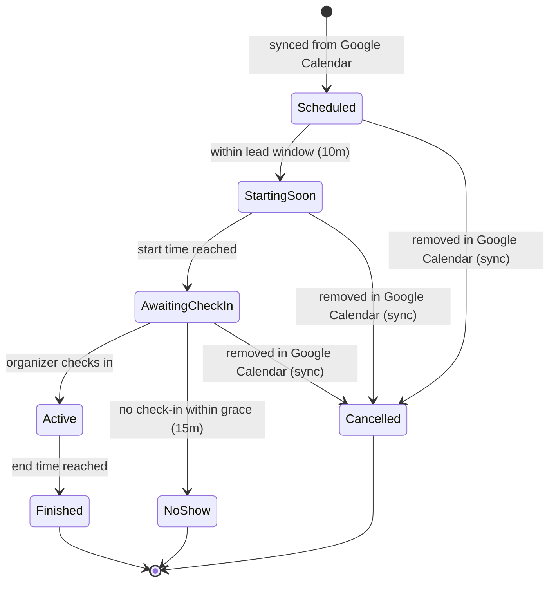
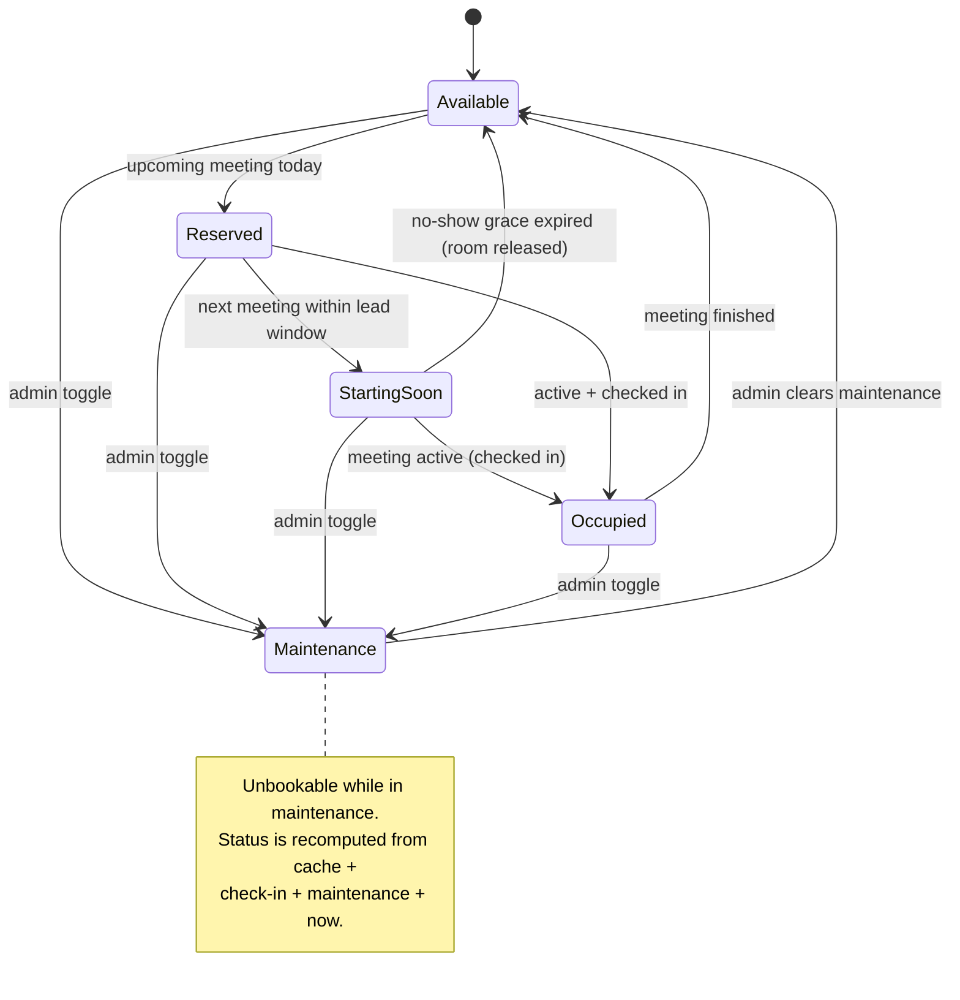
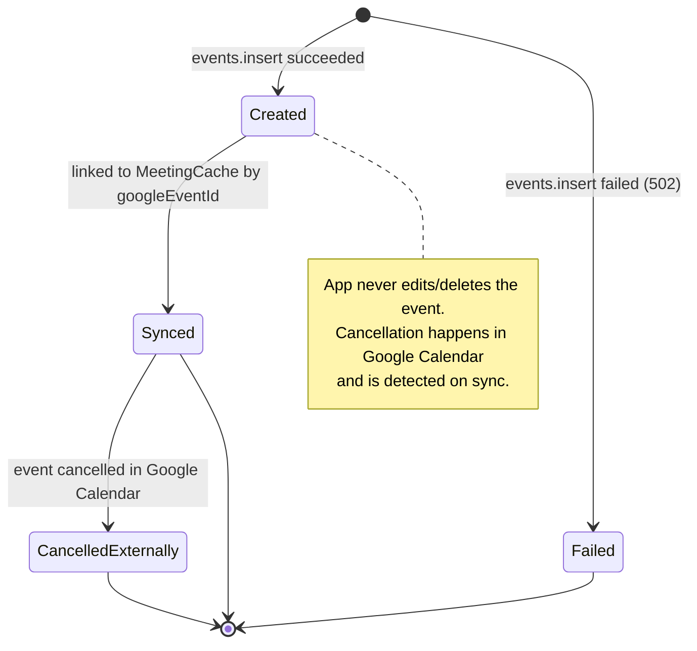
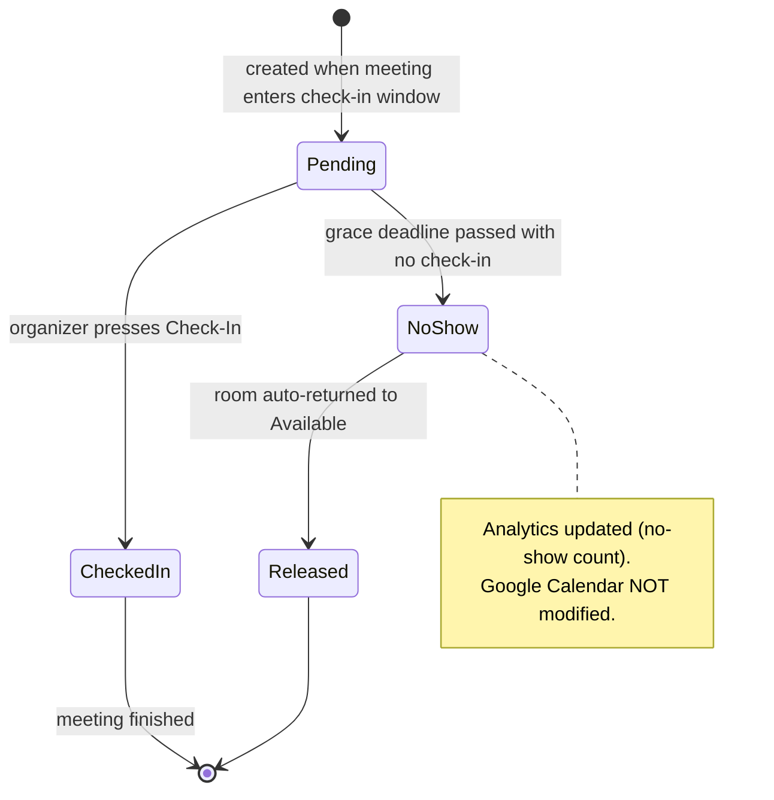
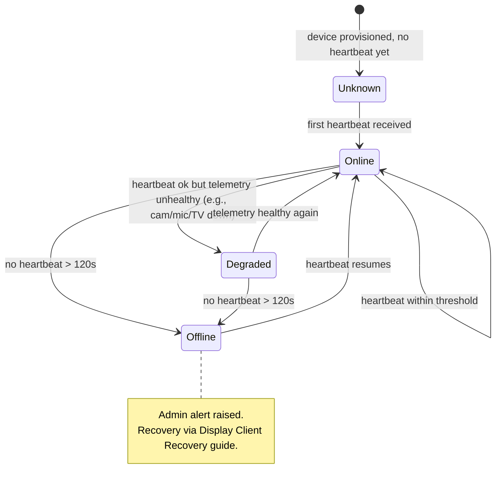
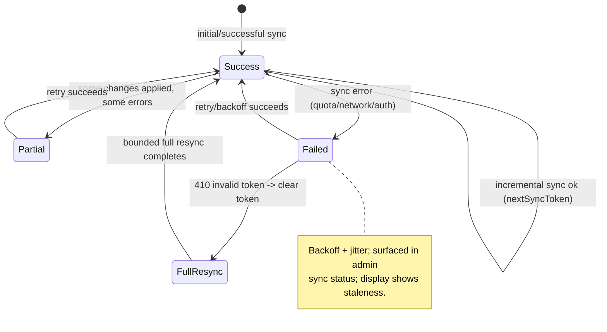

# State Machines

> **Purpose:** State diagrams for the core MRMS entities and lifecycles.
> **Scope:** Meeting, meeting room, booking, check-in, device status, Google sync status.
> **Version:** 1.0
> **Author:** MRMS Engineering Team - PT Mitra Prodin
> **Last Updated:** 2026-07-20
> **Related Documents:** [Software Architecture](../04-Software-Architecture.md), [Database Schema](../08-Database-Schema.md), [Decision Log](../decisions/README.md), [Sequence Diagrams](./SEQUENCE-DIAGRAMS.md)
> **References:** -

All diagrams use Mermaid `stateDiagram-v2`. Enum values reference
[Database Schema](../08-Database-Schema.md).

## 1. Meeting (lifecycle from cache + check-in)

## 2. Meeting Room (RoomStatus - computed, server-authoritative)

## 3. Booking (app-initiated, create-only)

## 4. Check-In (app-only; PostgreSQL)

## 5. Device Status (Intel NUC)

## 6. Google Sync Status (per room, SyncState)

