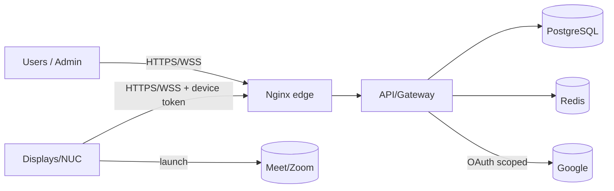

# Threat Model (STRIDE)

> **Purpose:** Systematic STRIDE threat analysis of MRMS with mitigations for every identified threat.
> **Scope:** Users, displays/devices, backend, datastores, Google integration, and network.
> **Version:** 1.0
> **Author:** MRMS Engineering Team - PT Mitra Prodin (acting Security Engineer)
> **Last Updated:** 2026-07-20
> **Related Documents:** [Security Guide](../SECURITY.md), [Authentication Flow](../12-Authentication-Flow.md), [Secrets Management](../SECRETS.md), [Risk Register](../RISK-REGISTER.md), [API Strategy](../API-STRATEGY.md)
> **References:** [Microsoft STRIDE](https://learn.microsoft.com/azure/security/develop/threat-modeling-tool-threats)

## 1. Assets & Trust Boundaries

**Assets:** user identities/sessions, JWT signing keys, Google credentials/tokens,
device tokens, reservation data (in Google + cache), check-in/analytics data,
audit logs, admin configuration.

**Trust boundaries:**
1. Person/Device ↔ MRMS (HTTPS/WSS via Nginx).
2. MRMS ↔ Google (OAuth-scoped, outbound).
3. NUC ↔ Meet/Zoom (direct from kiosk).
4. Internal services ↔ datastores (private network).

## 2. STRIDE Analysis

### S - Spoofing (identity)
| Threat | Mitigation |
|--------|------------|
| Impersonating a user | Google OAuth only; verify `id_token` signature/`exp`/issuer/domain; short-lived RS256 JWT |
| Forged JWT | RS256 signature verification; key rotation; reject invalid `iss`/`aud` |
| Spoofed display/device | Room-scoped device tokens, hashed at rest, verified per request; revocable |
| Spoofed Google push webhook | Validate watch-channel token before acting; treat push as trigger only |
| OAuth CSRF on callback | `state` parameter validation |

### T - Tampering (integrity)
| Threat | Mitigation |
|--------|------------|
| Tampering with requests | HTTPS/TLS; DTO validation (whitelist); server-authoritative status |
| SQL injection | Prisma parameterization; no string-concatenated SQL |
| Tampering with cache | Redis on private network; cache is non-authoritative (rebuildable from PG) |
| Tampering with images/artifacts | Pinned Docker image tags; CI build integrity; (optional signed commits) |
| Man-in-the-middle | TLS everywhere; HSTS; internal traffic on private network |

### R - Repudiation (non-attribution)
| Threat | Mitigation |
|--------|------------|
| User denies an action | Audit log (`SystemLog` AUDIT/ACTIVITY) with actor/action/target/timestamp |
| Missing traceability | Correlation IDs across API/worker/WS logs and error envelopes |
| Log tampering | Append-only audit records; centralized shipping (Loki); retention policy |

### I - Information Disclosure (confidentiality)
| Threat | Mitigation |
|--------|------------|
| Secret leakage | No secrets in VCS; secret store; encrypted Google tokens; hashed device tokens; secret scanning + push protection |
| Over-exposure of meeting/personal data | Store minimal metadata; RBAC restricts access; least-privilege queries |
| Secrets in logs | Logging convention forbids secrets/PII; redact by key name |
| Data exposed to client bundle | Only `VITE_*` public config shipped to frontend |
| Verbose error leakage | Standard error envelope; internal detail to logs only |
| CORS over-permissiveness | Origin allowlist; no wildcard in prod |

### D - Denial of Service (availability)
| Threat | Mitigation |
|--------|------------|
| Auth/booking brute force / flooding | Rate limiting (Redis-backed) on `auth`/`booking`; `429` |
| Google quota exhaustion (self-inflicted) | Incremental sync + watch channels + backoff + per-room spacing |
| WebSocket connection exhaustion | Scoped channels; horizontal gateway scale; connection limits |
| Resource exhaustion (DB/Redis/host) | Health checks; alerts; capacity planning; retention jobs |
| Queue flooding | BullMQ concurrency limits; DLQ; backoff |
| Malicious large payloads | Body size limits; DTO validation |

### E - Elevation of Privilege (authorization)
| Threat | Mitigation |
|--------|------------|
| Employee accessing admin functions | RBAC guards on every protected REST/WS op; deny-by-default; admin-only routes require ADMINISTRATOR |
| Device performing user/admin actions | Device principal is limited to its room scope (read/subscribe + heartbeat) |
| Privilege via forged role claim | Role derived server-side from verified identity/allowlist, not client input |
| Channel authorization bypass (WS) | Channel joins authorized by role/room scope on handshake |
| Requesting excessive Google scope | Least-privilege scopes fixed (readonly + events); no edit/delete ever requested |

## 3. Residual Risks & Cross-Reference

- Highest operational risks are tracked in the [Risk Register](../RISK-REGISTER.md)
  (R-01 quota, R-08 secret leakage, R-09 OAuth misconfig, R-10 device token
  compromise, R-23 dependency vulns).
- STRIDE mitigations align with the OWASP mapping in the
  [Security Guide §13](../SECURITY.md).

## 4. Actions Before/During Sprint 1

- Enable GitHub **secret scanning + push protection** and wire **gitleaks** in CI
  (TD-007).
- Implement config validation (fail-fast) and rate limiting early (TB-016/TB-017).
- Confirm domain allowlist and admin allowlist/group for role assignment.
- Add security tests for RBAC and device-scope enforcement
  ([Testing Strategy](../TESTING-STRATEGY.md)).

## 5. Review Cadence

Re-run this threat model when a new bounded context, external integration, or
auth change is introduced (via [RFC](../rfc/README.md)), and at each release
candidate security review.
