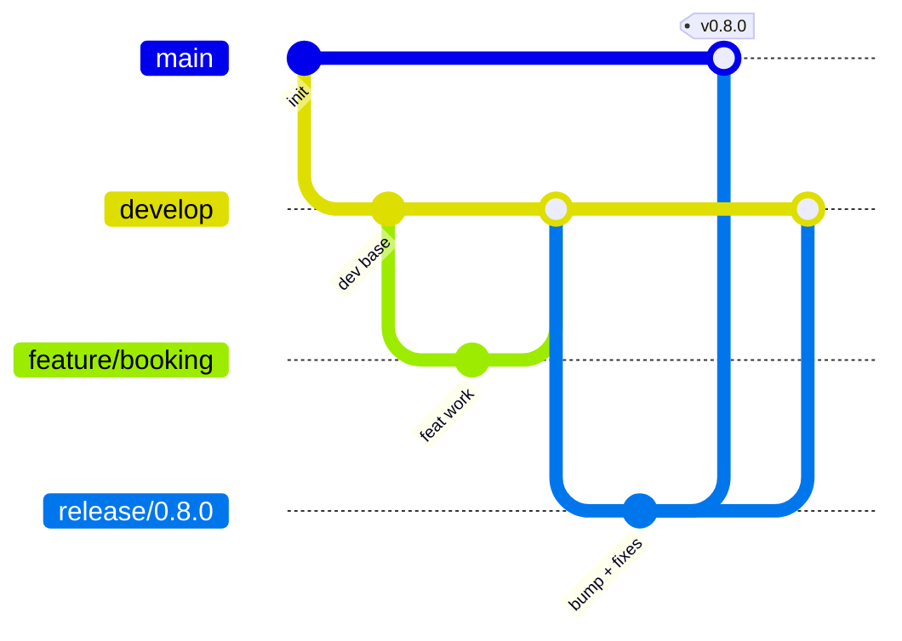

# Git Convention (Git Flow)

MRMS uses **Git Flow** with **Conventional Commits**. See also
[commit-convention](./commit-convention.md) and
[branch-convention](./branch-convention.md).

## 1. Long-Lived Branches

| Branch | Purpose | Deployable |
|--------|---------|------------|
| `main` | Production-ready, release-tagged history | Yes (prod) |
| `develop` | Integration of completed work for the next release | Yes (staging) |

- `main` only ever receives merges from `release/*` and `hotfix/*`.
- `develop` receives merges from `feature/*` and `bugfix/*`.

## 2. Supporting Branches

| Prefix | Branches from | Merges into | Purpose |
|--------|---------------|-------------|---------|
| `feature/*` | `develop` | `develop` | New features |
| `bugfix/*` | `develop` | `develop` | Non-urgent bug fixes |
| `release/*` | `develop` | `main` + `develop` | Stabilize a release, bump version |
| `hotfix/*` | `main` | `main` + `develop` | Urgent production fixes |

## 3. Standard Flow

1. Create `feature/<id>-
` from `develop`.
2. Commit using Conventional Commits; keep commits focused (one task = one commit
   where possible).
3. Open a PR into `develop`; pass CI + review (see PR template & branch protection).
4. Squash-merge to keep linear history; delete the branch after merge.
5. When ready to release, cut `release/x.y.z` from `develop`, finalize
   CHANGELOG + version, merge to `main`, tag `vx.y.z`, then merge back to `develop`.
6. Urgent production issues use `hotfix/*` off `main`, tagged, merged back to both.

## 4. Workflow Policy Alignment

- **One task = one meaningful commit** where possible; no unrelated changes bundled.
- **Push completed milestones immediately**; do not accumulate local commits.
- **Every sprint ends with a tagged release** (see `docs/MILESTONES.md`).
- Every commit must build and pass lint, typecheck, and tests.
- No force-push, reset --hard, or history rewrites on shared branches.
- Never skip hooks (`--no-verify`) or modify shared git config.

## 5. Pull Requests

- Target `develop` (features/bugfixes) or `main` (releases/hotfixes only).
- PR title follows Conventional Commits; fill the PR template completely.
- Link the related issue; require green CI and the configured approvals.
